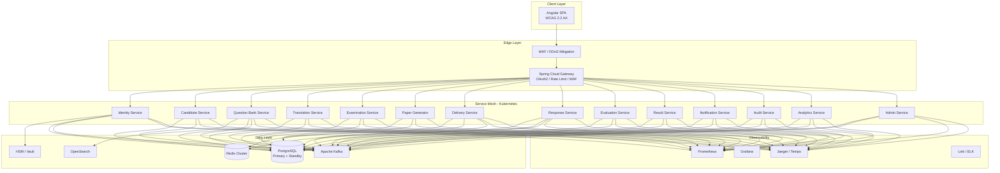
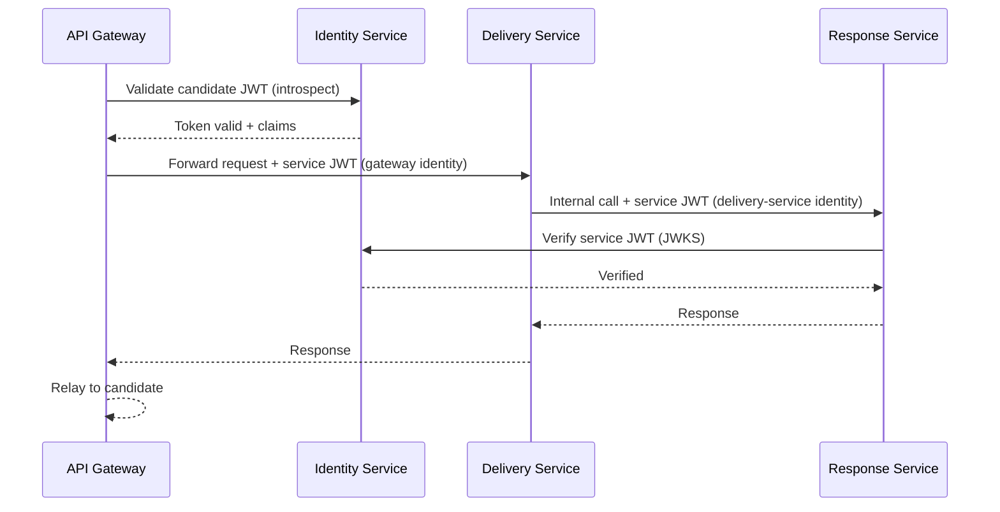
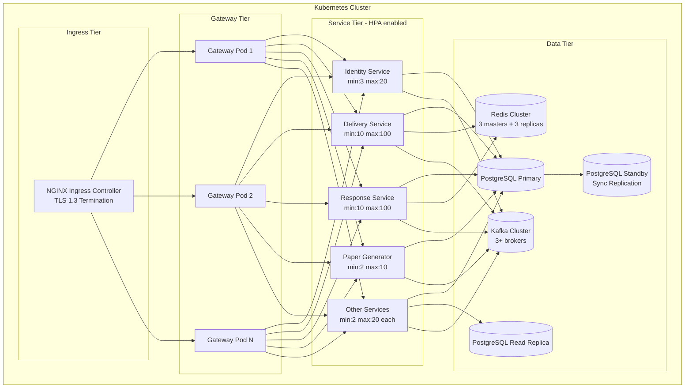

# Design Document

## Open Source Government Examination Platform

---

## Overview

The Open Source Government Examination Platform is a cloud-native, microservices-based system built to conduct national-scale government examinations at 500,000 concurrent sessions. The platform is designed around four core imperatives: **Security First** (HSM-managed keys, Zero Trust, AES-256), **Massive Scale** (horizontal pod autoscaling, Kafka-backed async pipelines, Redis caching), **Availability** (99.99% SLA, RPO=0, RTO=15 min), and **Vendor Neutrality** (CNCF-conformant Kubernetes, Helm charts, open standards).

### Architecture Philosophy

The system follows a **domain-driven microservices** decomposition. Each bounded context maps to an independently deployable Spring Boot service. All services are stateless; session and transient state live in Redis. Durable state lives in PostgreSQL with per-service schemas. Asynchronous domain events flow over Apache Kafka. The Angular SPA communicates exclusively through a Spring Cloud Gateway API Gateway that enforces authentication, rate limiting, and WAF rules.

---

## Architecture

### High-Level System Architecture




### Microservices Catalog

| Service | Bounded Context | Key Responsibilities |
|---|---|---|
| **Identity Service** | Auth / IAM | Registration, MFA, OAuth2/OIDC token issuance, RBAC/ABAC enforcement, Zero Trust service-to-service JWT, session management, HSM key integration |
| **Candidate Service** | Candidate Profile | PII storage (AES-256), DigiLocker integration, face verification, disability accommodations, DPDP erasure |
| **Question Bank Service** | Question Content | Question CRUD, versioning, lifecycle FSM, similarity detection, exposure tracking, reuse policy enforcement, full-text search (OpenSearch) |
| **Translation Service** | Multilingual Content | Translation workflow for 22 scheduled languages, stale-translation detection, UTF-8 content management |
| **Examination Service** | Exam Config + Scheduling | Exam definition, section configuration, marking schemes, navigation policies, calculator/review-flag policies; examination scheduling (dates, shifts, centres, seat allocation); multi-stage schedule approval workflow; schedule versioning and amendment workflow |
| **Paper Generator** | Paper Assembly | Blueprint-driven paper assembly, statistical balance validation, shift comparability, HSM-encrypted paper packaging |
| **Delivery Service** | Exam Runtime | Shift-key-based paper decryption, question serving, navigation policy enforcement, offline delivery, proctoring capture |
| **Response Service** | Response Capture | Sub-200ms response persistence, auto-save pipeline, offline buffer reconciliation, revision history, session finalization |
| **Evaluation Service** | Scoring | Auto-evaluation of MCQ/Numerical, partial marking, descriptive routing, dual-evaluator reconciliation |
| **Result Service** | Result Processing | Score aggregation, rank/percentile computation, shift normalization, PDF scorecard generation, DigiLocker push |
| **Notification Service** | Notifications | Email/push delivery, in-app event sourcing, PII-free message bodies, delivery retry tracking |
| **Audit Service** | Audit Trail | Append-only HSM-signed event log, tamper detection, 7-year retention, query API for Auditors |
| **Analytics Service** | Examination Analytics | Difficulty/discrimination indices, score distributions, per-question and per-exam dashboards |
| **Admin Service** | Platform Operations | Multi-tenancy, user management, configuration API, Super_Admin console |

---

## Components and Interfaces

### API Gateway Contract

All external traffic enters through Spring Cloud Gateway. The gateway enforces:

- **OAuth2 token validation** via Keycloak introspection endpoint before routing
- **Rate limiting** via Redis token-bucket: 1,000 req/min standard, configurable for partners
- **WAF rules** via integration with ModSecurity / cloud WAF adapter
- **Request sanitization** — strips dangerous headers, validates Content-Type
- **TLS 1.3 termination** at the gateway ingress

```
Base URL: https://{host}/api/v1/{service-prefix}/...

Common Headers (all requests):
  Authorization: Bearer <JWT>
  X-Request-Id: <UUID>
  X-Tenant-Id: <authority-id>
  Content-Type: application/json
  Accept-Language: en / hi / ta / ...

Common Response Envelope:
{
  "status": "success" | "error",
  "data": { ... },
  "error": { "code": "ERR_CODE", "message": "...", "traceId": "..." },
  "pagination": { "page": 1, "size": 20, "total": 1000 }
}
```


### Key Service APIs

#### Identity Service (`/api/v1/identity`)

| Method | Path | Description |
|---|---|---|
| POST | `/register` | Candidate registration with identity document |
| POST | `/otp/verify` | OTP verification → activate account + issue JWT |
| POST | `/auth/token` | Password + MFA → JWT access + refresh tokens |
| POST | `/auth/webauthn` | FIDO2/WebAuthn authentication |
| POST | `/auth/refresh` | Refresh JWT using valid refresh token |
| DELETE | `/auth/session` | Logout / invalidate session |
| POST | `/roles/{userId}` | Assign/revoke roles (Super_Admin only) |
| GET | `/jwks` | Public JWKS for downstream JWT verification |

#### Question Bank Service (`/api/v1/questions`)

| Method | Path | Description |
|---|---|---|
| POST | `/` | Create question (Draft state) |
| PUT | `/{id}` | Update question content/metadata |
| GET | `/{id}` | Retrieve question by ID |
| POST | `/{id}/transition` | Lifecycle state transition |
| GET | `/search` | Full-text search via OpenSearch |
| GET | `/{id}/versions` | Retrieve version history |
| GET | `/{id}/analytics` | Difficulty/discrimination/usage stats |

#### Paper Generator (`/api/v1/papers`)

| Method | Path | Description |
|---|---|---|
| POST | `/generate` | Submit blueprint → async paper generation job |
| GET | `/jobs/{jobId}` | Poll generation job status |
| GET | `/{paperId}` | Retrieve paper metadata (no content — HSM encrypted) |
| POST | `/{paperId}/approve` | Approve paper for use |
| POST | `/validate` | Validate Paper JSON against schema (round-trip) |

#### Examination Service (`/api/v1/examinations`)

| Method | Path | Description |
|---|---|---|
| POST | `/` | Create examination (Draft state) |
| PUT | `/{id}` | Update examination config |
| PUT | `/{id}/publish` | Publish examination configuration |
| GET | `/` | List examinations (tenant-scoped, paginated) |
| GET | `/{id}` | Get examination by ID |
| POST | `/{id}/schedules` | Create a new schedule for an examination |
| GET | `/{id}/schedules` | List all schedule versions for an examination |
| GET | `/{id}/schedules/{scheduleId}` | Get one schedule |
| PUT | `/{id}/schedules/{scheduleId}/transition` | Transition schedule through approval workflow |
| PUT | `/{id}/schedules/{scheduleId}/amend` | Submit a schedule amendment (mandatory reason) |
| POST | `/{id}/schedules/{scheduleId}/shifts` | Add a shift to a schedule |
| PUT | `/{id}/schedules/{scheduleId}/shifts/{shiftId}` | Update shift timings |
| POST | `/centres` | Create an examination centre |
| GET | `/centres` | List centres (filter by state/district/city) |
| POST | `/{id}/schedules/{scheduleId}/shifts/{shiftId}/allocations` | Allocate seats at a centre for a shift |
| GET | `/{id}/schedules/{scheduleId}/shifts/{shiftId}/allocations` | Get seat allocations for a shift |


| Method | Path | Description |
|---|---|---|
| POST | `/{sessionId}/save` | Save/update a single response |
| POST | `/{sessionId}/bulk-save` | Reconcile buffered offline responses |
| POST | `/{sessionId}/submit` | Finalize and lock response set |
| GET | `/{sessionId}/responses` | Retrieve all responses (Evaluator/Auditor) |

### Inter-Service Communication

Services communicate via two channels:

1. **Synchronous REST** (within the same request path): Gateway → Identity → downstream service. All calls use service-account JWTs (Zero Trust).
2. **Asynchronous Kafka events** (domain events across bounded contexts):

```
Kafka Topics:
  exam.identity.events          (login, logout, role-change)
  exam.question.lifecycle       (state transitions, creation)
  exam.paper.events             (generation, approval)
  exam.session.events           (start, submission, expiry)
  exam.response.saved           (partitioned by session_id)
  exam.evaluation.events        (evaluation submitted)
  exam.result.published         (result publication)
  exam.audit.events             (all audit writes → Audit Service)
  exam.notifications.outbound   (Notification Service consumption)
  exam.proctoring.alerts        (proctoring anomalies)
```

Kafka is configured with **replication factor 3**, **min.insync.replicas=2**, and **acks=all** on producer side to guarantee no response loss (RPO=0).


---

## Data Models

### Candidate

```java
// Domain model — stored in candidate_service schema
public class Candidate {
    UUID            id;                     // PK, UUID v4
    String          tenantId;               // Examination authority
    // --- Identity (all AES-256 encrypted at column level) ---
    String          fullName;               // encrypted
    LocalDate       dateOfBirth;            // encrypted
    String          gender;                 // encrypted
    String          nationality;            // encrypted
    String          category;               // GEN / OBC / SC / ST / EWS
    String          reservationCategory;    // encrypted
    String          mobile;                 // encrypted, SHA-256 hash stored separately for uniqueness
    String          email;                  // encrypted
    String          address;                // encrypted (JSON blob)
    // --- Identity Documents ---
    String          identityDocType;        // AADHAAR / PAN / PASSPORT / VOTER_ID / DL
    String          identityDocNumber;      // encrypted
    String          identityDocHash;        // HMAC-SHA256 for duplicate detection
    String          digiLockerVerified;     // PENDING / VERIFIED / FAILED
    String          faceVerificationStatus; // PENDING / VERIFIED / FAILED
    // --- Account State ---
    String          accountStatus;          // PENDING / ACTIVE / LOCKED / DEACTIVATED
    Instant         registeredAt;
    Instant         lastLoginAt;
    String          encryptionKeyId;        // Per-candidate key reference in HSM/Vault
    // --- Education ---
    List<Education> educationHistory;       // stored as JSONB
    // --- Disability ---
    boolean         hasDisability;
    Integer         extraTimeMinutes;
    boolean         consentRecorded;
    Instant         consentTimestamp;
}
```

### Question

```java
public class Question {
    UUID            id;
    UUID            tenantId;
    Long            version;                // optimistic lock + version history
    String          lifecycleState;         // DRAFT / REVIEW / APPROVED / PUBLISHED / ARCHIVED
    String          questionType;           // SINGLE_MCQ / MULTI_MCQ / NUMERICAL / DESCRIPTIVE /
                                            // MATRIX_MATCH / ASSERTION_REASON / CODING / CASE_STUDY
    String          subject;
    String          topic;
    String          subtopic;
    String          chapter;
    String          difficultyLevel;        // EASY / MEDIUM / HARD / VERY_HARD
    String          cognitiveLevel;         // REMEMBER / UNDERSTAND / APPLY / ANALYZE / EVALUATE / CREATE
    // --- Encrypted content fields ---
    byte[]          questionTextEncrypted;  // AES-256, per-question key
    byte[]          optionsEncrypted;       // JSON array of options
    byte[]          answerKeyEncrypted;     // correct option(s) or numerical range
    byte[]          explanationEncrypted;
    String          contentKeyId;           // HSM key reference for this question
    // --- Media ---
    List<String>    mediaAttachmentIds;     // references to object store
    // --- Exposure Tracking ---
    Integer         usageCount;
    Instant         lastUsedAt;
    List<UUID>      usedInExamIds;
    List<UUID>      usedInShiftIds;
    // --- Reuse Policy ---
    String          reusePolicy;            // NEVER / ONE_YEAR / TWO_YEARS / CUSTOM
    Integer         customReuseDays;
    // --- Similarity ---
    float[]         embeddingVector;        // stored in pg vector extension for similarity search
    // --- Ownership ---
    UUID            authorId;
    UUID            reviewerId;
    UUID            approverId;
    Instant         createdAt;
    Instant         updatedAt;
}
```

### QuestionVersion

```java
public class QuestionVersion {
    UUID    id;
    UUID    questionId;         // FK → Question
    Long    versionNumber;
    UUID    authorId;
    Instant changedAt;
    String  changedFields;      // JSON diff of modified fields
    byte[]  snapshotEncrypted;  // full encrypted snapshot of the question at this version
    String  contentKeyId;
}
```


### Translation

```java
public class Translation {
    UUID    id;
    UUID    questionId;         // FK → Question (source question)
    Long    sourceVersion;      // version of source question at translation time
    String  languageCode;       // ISO 639-1 + BCP47 (e.g., "hi", "ta", "kn")
    String  status;             // DRAFT / REVIEW / APPROVED / STALE
    byte[]  translatedTextEncrypted;
    byte[]  translatedOptionsEncrypted;
    byte[]  translatedExplanationEncrypted;
    String  contentKeyId;
    UUID    translatorId;
    UUID    reviewerId;
    Instant createdAt;
    Instant approvedAt;
    String  reviewComments;
}
```

### Examination

```java
public class Examination {
    UUID            id;
    UUID            tenantId;
    String          name;
    String          code;                   // unique examination code per tenant
    String          conductingAuthority;
    String          category;               // RECRUITMENT / ENTRANCE / CERTIFICATION / DEPARTMENTAL
    String          examinationType;        // PRELIMINARY / MAIN / SKILL_TEST / INTERVIEW / PHYSICAL_TEST
    String          academicYear;           // e.g. "2026-27"
    String          examinationMode;        // CBT / OMR / HYBRID
    String          status;                 // DRAFT / APPROVED / PUBLISHED / CANCELLED / COMPLETED
    Integer         durationMinutes;
    Integer         totalMarks;
    boolean         negativeMarkingEnabled;
    BigDecimal      negativeMarksPerWrong;
    String          navigationPolicy;       // SEQUENTIAL / FLEXIBLE / RESTRICTED
    String          calculatorPolicy;       // NONE / BASIC / SCIENTIFIC
    boolean         reviewFlagEnabled;
    boolean         shiftNormalizationEnabled;
    String          normalizationFormula;
    List<Section>   sections;               // stored as JSONB
    UUID            createdBy;
    Instant         createdAt;
    Instant         publishedAt;
    String          encryptionKeyId;        // exam-level key reference
}

public class Section {
    UUID        id;
    String      name;
    Integer     questionCount;
    BigDecimal  marksPerQuestion;
    Integer     timeLimitMinutes;           // nullable
    List<SubjectTopicRule> distributionRules;
}
```

### ExaminationSchedule

```java
public class ExaminationSchedule {
    UUID        id;
    UUID        tenantId;
    UUID        examinationId;              // FK → Examination
    String      scheduleName;
    Integer     version;                    // incremented on every amendment
    String      notificationNumber;         // government notification reference
    LocalDate   examDate;
    LocalDate   reserveDate;               // backup date; must not conflict with other schedules
    String      timeZone;                  // default "Asia/Kolkata"
    String      status;                    // DRAFT / SCHEDULER_REVIEW / CONTROLLER_APPROVED /
                                           // SECURITY_REVIEW / CHAIRMAN_APPROVED / PUBLISHED / CANCELLED
    String      changeReason;              // mandatory on amendments to Published schedules
    LocalDate   effectiveFrom;
    UUID        createdBy;
    Instant     createdAt;
    UUID        modifiedBy;
    Instant     modifiedAt;
    UUID        approvedBy;
    Instant     approvedAt;
    UUID        previousVersionId;         // FK → prior ExaminationSchedule version
}
```

### ExamShift

```java
public class ExamShift {
    UUID        id;
    UUID        tenantId;
    UUID        scheduleId;                // FK → ExaminationSchedule
    Integer     shiftNumber;               // 1, 2, 3...
    String      shiftName;                 // "Morning" / "Afternoon" / "Evening"
    LocalTime   reportingTime;
    LocalTime   gateClosingTime;
    LocalTime   loginStartTime;
    LocalTime   examStartTime;
    LocalTime   examEndTime;
    LocalTime   exitTime;
    Integer     durationMinutes;           // must equal examEndTime − examStartTime
    Integer     bufferMinutes;             // buffer before next shift
}
```

### ExaminationCentre

```java
public class ExaminationCentre {
    UUID        id;
    UUID        tenantId;
    String      region;
    String      state;
    String      district;
    String      city;
    String      centreName;
    String      building;
    String      floor;
    String      laboratoryIdentifier;
    Integer     totalCapacity;
    boolean     active;
}
```

### ShiftSeatAllocation

```java
public class ShiftSeatAllocation {
    UUID        id;
    UUID        tenantId;
    UUID        shiftId;                   // FK → ExamShift
    UUID        centreId;                  // FK → ExaminationCentre
    Integer     totalSeats;
    Integer     availableSeats;
    Integer     reservedSeats;
    Integer     pwdSeats;                  // Persons with Disabilities
    Integer     emergencyBufferSeats;
    Integer     femaleReservedSeats;
    Integer     specialCategorySeats;
}
```

### Paper and PaperQuestion

```java
public class Paper {
    UUID            id;
    UUID            examinationId;
    UUID            shiftId;
    Integer         shiftNumber;
    String          status;                 // DRAFT / APPROVED / ENCRYPTED / DELIVERED
    // Blueprint snapshot
    String          blueprintJson;          // full blueprint spec as JSON
    // Statistical reports
    BigDecimal      difficultyScore;
    String          topicDistributionReport;    // JSON
    String          similarityReport;           // JSON
    // Encrypted package
    byte[]          encryptedPackageRef;        // reference to object store, NOT inline content
    String          shiftEncryptionKeyId;       // HSM key reference, shift-specific
    UUID            generatedBy;
    UUID            approvedBy;
    Instant         generatedAt;
    Instant         approvedAt;
    // Serialized form (for round-trip)
    String          paperSchemaVersion;         // e.g., "1.0"
}

public class PaperQuestion {
    UUID    id;
    UUID    paperId;            // FK → Paper
    UUID    sectionId;
    UUID    questionId;         // FK → Question (identifier only, NO content stored here)
    Integer sequenceNumber;
    BigDecimal marksIfCorrect;
    BigDecimal marksIfWrong;
    BigDecimal marksIfPartial;  // for MULTI_MCQ
}
```


### Response

```java
public class Response {
    UUID        id;
    UUID        sessionId;              // FK → ExamSession
    UUID        candidateId;
    UUID        questionId;
    UUID        paperId;
    Integer     revisionSequence;       // monotonically increasing per question per session
    String      responseType;           // OPTION_SELECTED / NUMERICAL / TEXT / CODE
    List<UUID>  selectedOptionIds;      // for MCQ
    String      enteredValue;           // for Numerical/Descriptive/Coding
    Boolean     flaggedForReview;
    Long        cumulativeTimeSpentMs;
    Instant     savedAt;
    String      saveSource;             // CANDIDATE_ACTION / AUTO_SAVE / NAVIGATION / OFFLINE_SYNC
    boolean     isFinal;               // true once session is submitted
}
```

### ExamSession

```java
public class ExamSession {
    UUID        id;
    UUID        candidateId;
    UUID        examinationId;
    UUID        paperId;
    UUID        shiftId;
    String      status;                 // PENDING / ACTIVE / SUBMITTED / EXPIRED / FLAGGED
    String      selectedLanguage;
    Instant     scheduledStartAt;
    Instant     actualStartAt;
    Instant     scheduledEndAt;
    Instant     submittedAt;
    String      deviceFingerprint;
    String      ipAddress;
    Integer     fullScreenExitCount;
    boolean     flaggedForReview;
    // Proctoring
    Instant     lastProctorSnapshotAt;
    Integer     suspiciousActivityCount;
}
```

### Evaluation

```java
public class Evaluation {
    UUID        id;
    UUID        responseId;             // FK → Response
    UUID        questionId;
    UUID        candidateId;
    UUID        sessionId;
    String      evaluationType;         // AUTO / MANUAL_FIRST / MANUAL_SECOND / MANUAL_ARBITRATION
    UUID        evaluatorId;            // null for AUTO
    BigDecimal  scoreAwarded;
    String      evaluatorComments;
    Instant     evaluatedAt;
    boolean     isReconciled;
    UUID        reconciledById;
    Instant     reconciledAt;
}
```

### Result

```java
public class Result {
    UUID                    id;
    UUID                    candidateId;
    UUID                    examinationId;
    UUID                    shiftId;
    BigDecimal              totalRawScore;
    BigDecimal              normalizedScore;
    Map<UUID, BigDecimal>   sectionScores;      // sectionId → score (JSONB)
    Integer                 overallRank;
    BigDecimal              overallPercentile;
    Integer                 shiftRank;
    BigDecimal              shiftPercentile;
    String                  status;             // COMPUTED / PUBLISHED / WITHHELD
    Instant                 computedAt;
    Instant                 publishedAt;
    String                  scorecardPdfRef;    // object store reference
    boolean                 pushedToDigiLocker;
}
```

### AuditEvent

```java
public class AuditEvent {
    UUID        id;                     // UUID v4
    UUID        tenantId;
    String      eventType;              // LOGIN / LOGOUT / QUESTION_CREATED / PAPER_GENERATED / ...
    UUID        actorId;
    String      actorRole;
    UUID        resourceId;             // ID of the affected resource
    String      resourceType;           // CANDIDATE / QUESTION / PAPER / SESSION / RESULT / ...
    String      eventPayload;           // JSON — immutable event detail
    String      ipAddress;
    String      deviceFingerprint;
    Instant     occurredAt;
    // Tamper evidence
    byte[]      payloadHash;            // SHA-256 of eventPayload
    byte[]      hsmSignature;           // RSA-PSS / ECDSA signature over payloadHash
    String      signingKeyId;           // HSM key ID used to sign
    // Immutability enforced at DB level (no UPDATE/DELETE grants)
}
```


---

## Database Schema Design

### Partitioning Strategy

PostgreSQL partitioning is critical for the three highest-volume tables. All services use separate schemas within a single PostgreSQL cluster (with a read replica per service that needs it).

#### `response` table — Range partitioning by `saved_at`

```sql
CREATE TABLE response_service.response (
    id                  UUID NOT NULL DEFAULT gen_random_uuid(),
    session_id          UUID NOT NULL,
    candidate_id        UUID NOT NULL,
    question_id         UUID NOT NULL,
    paper_id            UUID NOT NULL,
    revision_sequence   INT NOT NULL,
    response_type       VARCHAR(20) NOT NULL,
    selected_option_ids UUID[],
    entered_value       TEXT,
    flagged_for_review  BOOLEAN DEFAULT FALSE,
    cumulative_time_ms  BIGINT,
    saved_at            TIMESTAMPTZ NOT NULL,
    save_source         VARCHAR(20) NOT NULL,
    is_final            BOOLEAN DEFAULT FALSE,
    PRIMARY KEY (id, saved_at)
) PARTITION BY RANGE (saved_at);

-- Monthly partitions, created ahead of time
CREATE TABLE response_service.response_2025_01
    PARTITION OF response_service.response
    FOR VALUES FROM ('2025-01-01') TO ('2025-02-01');

-- Index on (session_id, question_id) within each partition
CREATE INDEX ON response_service.response (session_id, question_id, revision_sequence DESC);
CREATE INDEX ON response_service.response (candidate_id) WHERE is_final = TRUE;
```

#### `audit_event` table — Range partitioning by `occurred_at`

```sql
CREATE TABLE audit_service.audit_event (
    id                  UUID NOT NULL DEFAULT gen_random_uuid(),
    tenant_id           UUID NOT NULL,
    event_type          VARCHAR(60) NOT NULL,
    actor_id            UUID,
    actor_role          VARCHAR(40),
    resource_id         UUID,
    resource_type       VARCHAR(40),
    event_payload       JSONB NOT NULL,
    ip_address          INET,
    device_fingerprint  TEXT,
    occurred_at         TIMESTAMPTZ NOT NULL,
    payload_hash        BYTEA NOT NULL,
    hsm_signature       BYTEA NOT NULL,
    signing_key_id      VARCHAR(100) NOT NULL,
    PRIMARY KEY (id, occurred_at)
) PARTITION BY RANGE (occurred_at);

-- Quarterly partitions (7-year retention = 28 partitions pre-created)
-- Append-only enforced via row-level security + role grants (no UPDATE/DELETE)
REVOKE UPDATE, DELETE ON audit_service.audit_event FROM audit_writer_role;
```

#### `question` table — Hash partitioning by `id`

```sql
CREATE TABLE question_service.question (
    id                  UUID NOT NULL DEFAULT gen_random_uuid(),
    tenant_id           UUID NOT NULL,
    version             BIGINT NOT NULL DEFAULT 1,
    lifecycle_state     VARCHAR(20) NOT NULL DEFAULT 'DRAFT',
    question_type       VARCHAR(30) NOT NULL,
    subject             VARCHAR(100) NOT NULL,
    topic               VARCHAR(100) NOT NULL,
    subtopic            VARCHAR(100),
    chapter             VARCHAR(100),
    difficulty_level    VARCHAR(20) NOT NULL,
    cognitive_level     VARCHAR(20) NOT NULL,
    question_text_enc   BYTEA,
    options_enc         BYTEA,
    answer_key_enc      BYTEA,
    explanation_enc     BYTEA,
    content_key_id      VARCHAR(100) NOT NULL,
    usage_count         INT DEFAULT 0,
    last_used_at        TIMESTAMPTZ,
    embedding_vector    vector(1536),   -- pgvector for similarity search
    reuse_policy        VARCHAR(20) NOT NULL DEFAULT 'NEVER',
    custom_reuse_days   INT,
    author_id           UUID NOT NULL,
    reviewer_id         UUID,
    approver_id         UUID,
    created_at          TIMESTAMPTZ NOT NULL DEFAULT now(),
    updated_at          TIMESTAMPTZ NOT NULL DEFAULT now(),
    PRIMARY KEY (id)
) PARTITION BY HASH (id) PARTITIONS 16;

CREATE INDEX ON question_service.question (tenant_id, lifecycle_state, subject, difficulty_level);
CREATE INDEX ON question_service.question USING ivfflat (embedding_vector vector_cosine_ops);
```


### Connection Pooling and Read Replicas

Each service uses **PgBouncer** in transaction-mode pooling, with a maximum of 100 connections per service pod to the primary. Read-heavy services (Question Bank, Result, Analytics) connect to a **read replica** for non-transactional queries. The primary handles all writes and transactional reads (exam session, response save).

---

## Technology Stack Decisions

| Layer | Technology | Rationale |
|---|---|---|
| **Backend Framework** | Spring Boot 3.x (Java 21) | Production-proven for government-scale Java microservices; virtual threads (Project Loom) for high concurrency without reactive complexity; rich Spring Security / Spring Cloud ecosystem |
| **API Gateway** | Spring Cloud Gateway | Native Spring integration; reactive routing; built-in rate limiting via Redis; integrates with Spring Security for OAuth2 token relay |
| **Auth / IAM** | Keycloak (Spring Security + OAuth2/OIDC) | FOSS, self-hostable, FIDO2/WebAuthn support, fine-grained authorization; avoids cloud vendor lock-in |
| **Database** | PostgreSQL 16 | ACID, row-level security, pgvector for similarity, declarative partitioning, logical replication; best FOSS RDBMS for government data |
| **Message Broker** | Apache Kafka | Durable, high-throughput event log; supports RPO=0 with synchronous replication; natural fit for response capture at 500M events/day |
| **Cache** | Redis Cluster | Sub-millisecond session lookup; distributed token-bucket rate limiting; exam session state for 500K concurrent sessions |
| **Search** | OpenSearch | Full-text search over 100M questions; Elasticsearch-compatible; self-hostable; scales horizontally |
| **Container Runtime** | Docker + Kubernetes | Industry standard; CNCF-conformant; Helm for templated deployments; supports any cloud or on-premise cluster |
| **Service Mesh** | Istio (optional) / Spring Security mTLS | Zero Trust inter-service mTLS; Istio preferred for RBAC sidecar; Spring Security mTLS as lightweight fallback |
| **HSM Integration** | PKCS#11 → HashiCorp Vault (Transit Engine) | Vault provides HSM-abstracted key management; works with physical HSM (Thales, nCipher) or software HSM in dev |
| **Observability** | Prometheus + Grafana + OpenTelemetry (Jaeger/Tempo) + Loki | Vendor-neutral; CNCF-native stack; satisfies Req 21 |
| **Frontend** | Angular 17+ | Prescribed by constraints; strong accessibility support; Angular Material for WCAG compliance baseline |
| **PDF Generation** | iText / Apache PDFBox | Open-source PDF scorecard generation with password protection (Req 13.4) |
| **CI/CD** | GitHub Actions / GitLab CI | Prescribed by constraints; matrix pipelines for SAST/DAST |
| **SAST** | SpotBugs + OWASP Dependency-Check + Semgrep | Open-source SAST stack for Java |
| **DAST** | OWASP ZAP | FOSS DAST against staging environment |

---

## Security Architecture

### Zero Trust Inter-Service Authentication

Every service-to-service call is authenticated using a short-lived JWT signed by the Identity Service's Keycloak instance. No shared secrets or API keys are used between services.




### HSM Key Hierarchy

```
HSM Root Key (never leaves HSM hardware)
  └─ Platform Master Key (PMK) — derived from Root Key
       ├─ Service Encryption Keys (SEK)
       │    ├─ Candidate Service SEK
       │    │    └─ Per-Candidate Data Encryption Key (DEK) — AES-256
       │    ├─ Question Bank SEK
       │    │    └─ Per-Question DEK — AES-256
       │    └─ Audit Service Signing Key — ECDSA P-256
       ├─ Exam Encryption Keys (EEK)
       │    └─ Per-Shift Key — AES-256 (for paper package)
       └─ Backup Encryption Key (BEK) — AES-256

Key Operations via HashiCorp Vault Transit Engine (PKCS#11 backend → physical HSM):
  - Encrypt(keyId, plaintext) → ciphertext
  - Decrypt(keyId, ciphertext) → plaintext
  - Sign(keyId, payload) → signature
  - Verify(keyId, payload, signature) → boolean
  - Rotate(keyId) → new key version (old versions still decrypt; new encrypts)
  - Revoke(keyId) → disables key within 60 seconds (Req 16.5)
```

**Key Rotation:** Automated rotation intervals per key type — 90 days for DEKs, 365 days for EEKs. Rotation triggers re-encryption of data in a background job without service interruption (Req 16.4).

### Audit Tamper Evidence

Each `AuditEvent` is signed before write:

```
payloadHash    = SHA-256(eventPayload JSON bytes)
hsmSignature   = HSM.sign(auditSigningKeyId, payloadHash)  // ECDSA P-256
```

Verification by Auditor:
```
expectedHash  = SHA-256(storedEventPayload)
valid         = HSM.verify(signingKeyId, expectedHash, storedHsmSignature)
```

Any modification to `event_payload` breaks the `payload_hash`, and `hsm_signature` verification fails, proving tampering.

### Data Classification and Encryption at Rest

| Data Classification | Examples | Protection |
|---|---|---|
| **PII** | name, DOB, mobile, Aadhaar | AES-256 column encryption, per-candidate key, access via Candidate Service only |
| **Sensitive** | question content, answer keys | AES-256 column encryption, per-question key, accessed only by authorized service roles |
| **Exam Confidential** | paper definitions | AES-256, per-shift key, decrypted only in memory during delivery window |
| **Non-sensitive** | subject codes, lifecycle states, public exam names | Stored plaintext; indexed normally |

---

## Scalability and Deployment Architecture

### Kubernetes Deployment Model




### Horizontal Pod Autoscaling (HPA)

Critical services scale on custom Prometheus metrics rather than just CPU:

| Service | Scale Metric | Target |
|---|---|---|
| Delivery Service | `active_exam_sessions` / pod | 5,000 sessions/pod |
| Response Service | `response_save_rate` / pod | 50,000 saves/min/pod |
| Identity Service | `auth_request_rate` / pod | 1,000 req/sec/pod |
| Paper Generator | Queue depth of `exam.paper.generation.requests` | 1 job/pod |

### Helm Chart Structure

```
charts/
  examination-platform/
    Chart.yaml
    values.yaml                    # defaults (all configurable)
    values-production.yaml         # production overrides
    templates/
      identity-service/
        deployment.yaml
        service.yaml
        hpa.yaml
        configmap.yaml
      delivery-service/
      response-service/
      ... (one directory per microservice)
      infrastructure/
        kafka/
        redis/
        postgresql/
        vault/
      ingress/
      monitoring/
```

All environment-specific configuration (DB URLs, Kafka brokers, Vault address, HSM endpoints) is injected via Kubernetes Secrets (sealed with Sealed Secrets or External Secrets Operator — no plaintext secrets in Helm values).

### Availability and Disaster Recovery Design

- **PostgreSQL**: Patroni-managed HA with synchronous standby. Automatic failover < 30 seconds. PITR enabled with WAL archival to object storage every 60 seconds → RPO ≈ 0 when combined with Kafka-based event log.
- **Kafka**: 3-broker cluster, replication factor 3, min.insync.replicas=2. Response events are durably committed before the 200ms ACK is returned to the candidate (Req 10.1 + RPO=0).
- **Redis**: Redis Cluster with 3 master + 3 replica nodes. Session loss on Redis failure is tolerated — sessions are re-established from PostgreSQL. Exam state is backed by both Redis (hot) and PostgreSQL (durable).
- **RTO=15 min**: Achieved via pre-provisioned standby cluster (warm standby), automated Patroni failover, and Kubernetes readiness probes. Runbooks are automated via Argo Workflows.
- **Multi-AZ**: All stateful components (PostgreSQL, Kafka, Redis) are deployed across a minimum of 3 availability zones. Kubernetes pods use `topologySpreadConstraints` to ensure cross-AZ distribution.

---

## Observability Design

### Structured Logging

Every service emits JSON logs to stdout. The log collector (Fluentd/Vector) ships logs to Loki (or Elasticsearch). Log format:

```json
{
  "timestamp": "2025-01-15T10:30:00.000Z",
  "level": "INFO",
  "service": "delivery-service",
  "traceId": "4bf92f3577b34da6a3ce929d0e0e4736",
  "spanId": "00f067aa0ba902b7",
  "httpMethod": "GET",
  "path": "/api/v1/delivery/sessions/{id}/question/1",
  "statusCode": 200,
  "responseTimeMs": 48,
  "userId": "cand-***-4567",
  "sessionId": "sess-uuid",
  "tenantId": "exam-authority-uuid"
}
```

User identifiers are **masked** (last 4 chars only) in all log output. PII never appears in logs.

### Prometheus Metrics

Each service exposes `/actuator/prometheus` (Spring Boot Actuator). Key metrics per service:

```
# Common metrics (all services)
http_requests_total{service, method, path, status}
http_request_duration_seconds{service, quantile}
jvm_memory_used_bytes{area}
hikaricp_connections_active{pool}

# Domain-specific metrics
exam_active_sessions_total                    # Delivery Service
exam_response_saves_total{source}             # Response Service
exam_proctoring_alerts_total{alert_type}      # Delivery Service
exam_paper_generation_duration_seconds        # Paper Generator
audit_events_written_total{event_type}        # Audit Service
```

### Distributed Tracing

All services are instrumented with OpenTelemetry Java agent. The trace context (`traceId`, `spanId`) is propagated via W3C TraceContext headers through Kafka message headers and all HTTP calls. Traces are exported to Jaeger/Tempo.

Critical trace paths monitored end-to-end:
- Candidate login → session establishment (target < 2s)
- Question fetch during active session (target < 500ms)
- Response save pipeline (target < 200ms)

### Pre-built Grafana Dashboards

1. **Exam Operations** — active sessions, responses/sec, auto-save lag, session errors
2. **Authentication** — login rate, MFA success/fail, account lockouts, anomalous logins
3. **Question Bank** — question creation rate, lifecycle state distribution, similarity rejection rate
4. **Paper Generation** — generation job queue depth, generation duration, blueprint gap reports
5. **Proctoring** — alerts by type (no-face, multi-face, prohibited-object), flagged sessions
6. **Infrastructure** — Kafka consumer lag, Redis memory, PostgreSQL connections, JVM heap

**Alerting Rules** (Req 21.5): Error rate > 1% over 5-min window → PagerDuty/Slack alert within 2 minutes.


---

## Error Handling

### Error Response Standard

All services return RFC 7807 Problem Details:

```json
{
  "type": "https://platform.example.gov.in/errors/QUESTION_REUSE_VIOLATION",
  "title": "Question Reuse Policy Violation",
  "status": 422,
  "detail": "Question q-uuid was used in exam e-uuid on 2024-03-01 and is within its 1-year reuse window.",
  "traceId": "4bf92f3577b34da6a3ce929d0e0e4736",
  "instance": "/api/v1/papers/generate",
  "violatingQuestionId": "q-uuid",
  "reuseWindowExpiresAt": "2025-03-01T00:00:00Z"
}
```

### Critical Error Scenarios

| Scenario | Handling Strategy |
|---|---|
| **Network loss during exam** | Angular buffers responses in IndexedDB; Response Service reconciles on reconnect (Req 10.4) |
| **Response Service pod failure** | Kafka consumer rebalance < 30s; in-flight responses replay from Kafka; no data loss (RPO=0) |
| **HSM unavailable** | Cached decrypted session keys (short TTL in memory) allow serving in-progress exams for up to 5 minutes; new sessions blocked; alert triggered |
| **Blueprint gap during paper generation** | Gap report returned immediately; no partial paper generated (Req 8.5) |
| **Duplicate identity registration** | Identity Service returns 409 with error code `DUPLICATE_IDENTITY` (Req 1.5) |
| **Audit write failure** | Kafka-backed Audit Service; if Kafka is unavailable, audit events are buffered in a local WAL file and replayed; exam operations continue |
| **PDF generation failure** | Result stored in DB; scorecard PDF generation retried asynchronously; candidate notified when available |
| **Evaluation score divergence** | Flagged for third-party arbitration; response locked; escalation notification sent (Req 12.6) |

### Circuit Breaker Pattern

All synchronous inter-service calls use Resilience4j circuit breakers:
- `CLOSED` → normal operation
- `OPEN` (after 5 failures in 10s) → fast-fail with cached response or degraded mode
- `HALF_OPEN` → probe recovery before closing

During exam delivery, the Delivery Service can serve pre-cached questions from Redis even if the Question Bank Service is temporarily unavailable (graceful degradation).

---

## DevSecOps Pipeline Design

### CI/CD Pipeline Stages

```
Pull Request → [ Build → Unit Tests → Integration Tests → SAST ] → Block on HIGH severity

Merge to main → [ Build → Unit Tests → Integration Tests → SAST → DAST ]
             → [ Container Build → Image Scan (Trivy) → Push to Registry ]
             → [ Deploy to Staging → Smoke Tests ]
             → [ Manual Gate: Exam Controller approval ]
             → [ Deploy to Production (Helm upgrade --atomic) ]
```

### Stage Details

```yaml
# .github/workflows/ci.yml (abbreviated)
jobs:
  build-and-test:
    steps:
      - mvn clean verify                            # Unit + Integration tests
      - mvn spotbugs:check                          # SAST: SpotBugs
      - mvn dependency-check:check                  # SAST: OWASP Dependency-Check
      - semgrep --config=p/java --error             # SAST: Semgrep rules
  
  container-build:
    steps:
      - docker build --tag $REGISTRY/$SERVICE:$SHA .
      - trivy image --exit-code 1 --severity HIGH,CRITICAL $IMAGE  # Image scan
      - docker push $IMAGE

  dast:
    steps:
      - docker run owasp/zap2docker-stable zap-baseline.py -t $STAGING_URL
      - # On OWASP Top 10 finding: create GitHub issue + notify security team

  deploy:
    steps:
      - helm upgrade --install --atomic --timeout 10m $RELEASE ./charts/...
```

### Repository Structure (Req 27.1)

```
/
├── frontend/                   # Angular SPA
├── backend/
│   ├── identity-service/
│   ├── candidate-service/
│   ├── question-bank-service/
│   ├── translation-service/
│   ├── examination-service/
│   ├── paper-generator/
│   ├── delivery-service/
│   ├── response-service/
│   ├── evaluation-service/
│   ├── result-service/
│   ├── notification-service/
│   ├── audit-service/
│   ├── analytics-service/
│   └── admin-service/
├── infrastructure/
│   ├── helm/                   # Helm charts
│   ├── k8s/                    # Raw manifests
│   └── docker-compose/         # Dev environment
├── docs/
│   ├── architecture/
│   └── api/                    # OpenAPI 3.0 specs
├── LICENSE                     # Apache 2.0
├── CONTRIBUTING.md
└── SECURITY.md
```


---

## Correctness Properties

*A property is a characteristic or behavior that should hold true across all valid executions of a system — essentially, a formal statement about what the system should do. Properties serve as the bridge between human-readable specifications and machine-verifiable correctness guarantees.*

The following properties were derived from the acceptance criteria through prework analysis. Properties that would be redundant with a more general property have been consolidated. Properties covering UI aesthetics, infrastructure configuration, or fixed-threshold examples have been excluded from PBT and addressed as unit/integration/smoke tests instead.

**Property Reflection:** Properties 1 and 2 below both cover paper statistical correctness — they are distinct (blueprint constraint satisfaction is about composition, comparability is about pairwise difference) and each tests a different aspect of the Paper Generator, so both are retained. Response round-trip (Property 4) subsumes the weaker "response is persisted" check, so only the round-trip is stated. Lifecycle FSM (Property 8) is a single property covering all valid/invalid transitions rather than separate properties per transition.

---

### Property 1: Blueprint Constraint Satisfaction

*For any* valid blueprint specifying subject ratios, topic ratios, difficulty level ratios, and cognitive level ratios, and for any paper generated from that blueprint, every generated paper SHALL contain questions whose actual distribution of subjects, topics, difficulty levels, and cognitive levels matches the blueprint's specified ratios (within integer rounding tolerance).

**Validates: Requirements 8.1, 8.2**

---

### Property 2: Shift Paper Statistical Comparability

*For any* examination with two or more generated shift papers, the absolute difference in mean difficulty score between any pair of shift papers SHALL not exceed 2% of the total paper score.

Formally: for all pairs (paper_i, paper_j) generated for the same examination, `|difficultyScore(paper_i) - difficultyScore(paper_j)| / totalMarks ≤ 0.02`.

**Validates: Requirements 8.9**

---

### Property 3: Paper Serialization Round-Trip

*For any* valid Paper object (with arbitrary section count, question count, question types, blueprint metadata, and shift configuration), serializing it to JSON and then parsing the resulting JSON SHALL produce a Paper object that is deeply equal to the original. Furthermore, formatting the parsed object back to JSON SHALL produce a JSON document that is semantically equivalent to the original serialized document.

Formally: `parse(format(paper)) == paper` and `format(parse(json)) ≡ json` (up to field ordering).

**Validates: Requirements 28.2, 28.3, 28.4**

---

### Property 4: Paper Schema Validation Rejects Invalid Documents

*For any* Paper JSON document that contains at least one field value violating the Paper Schema (invalid question type enumeration, negative marks value, or missing required field), the Paper_Generator's validation function SHALL return an error response identifying the violating field name and the violating value.

Formally: for all Paper JSON documents `doc` such that `isValid(doc) = false`, `validate(doc).error.field ∈ fields(doc)` and `validate(doc).error.value = doc[violatingField]`.

**Validates: Requirements 28.5**

---

### Property 5: Response Persistence Round-Trip

*For any* Response record with arbitrary response type (OPTION_SELECTED, NUMERICAL, TEXT, CODE), arbitrary selected option set, arbitrary entered value (including Unicode content), and arbitrary revision sequence number, saving the response via the Response Service and reading it back SHALL produce a record with all fields bitwise-identical to the original.

Formally: `readResponse(saveResponse(r).id) == r` for all valid response `r`.

**Validates: Requirements 10.1**

---

### Property 6: Response Revision History Preservation

*For any* sequence of N ≥ 2 response updates to the same (sessionId, questionId) pair, querying the revision history after all updates SHALL return exactly N records with monotonically increasing revision sequence numbers (1 through N), and each record's content SHALL match the corresponding submitted update in the sequence.

Formally: for all update sequences `[r1, r2, ..., rN]`, `history(sessionId, questionId) = [r1', r2', ..., rN']` where `ri'.revisionSequence == i` and `ri'.value == ri.value`.

**Validates: Requirements 10.5**

---

### Property 7: Audit Event Tamper Detection

*For any* audit event that has been written and cryptographically signed by the Audit Service, verifying the HSM signature over the stored payload SHALL succeed. Conversely, for any audit event where one or more bytes of the stored event payload have been modified, the HSM signature verification SHALL fail.

Formally: `verify(signingKeyId, SHA256(payload), hsmSignature) = true` for all unmodified events, and `verify(signingKeyId, SHA256(modifiedPayload), hsmSignature) = false` for all events where `modifiedPayload ≠ payload`.

**Validates: Requirements 15.2**

---

### Property 8: Question Lifecycle State Machine

*For any* question in a given lifecycle state S ∈ {DRAFT, REVIEW, APPROVED, PUBLISHED, ARCHIVED}, only the valid successor states SHALL be accepted by the Question Bank Service, and all other target states SHALL be rejected.

Valid transitions: DRAFT→REVIEW, REVIEW→APPROVED, REVIEW→DRAFT (return with comments), APPROVED→PUBLISHED, PUBLISHED→ARCHIVED. All other (state, target) combinations SHALL produce a rejection response.

Formally: for all pairs (currentState, targetState), `transition(q, targetState)` succeeds if and only if `(currentState, targetState) ∈ VALID_TRANSITIONS`.

**Validates: Requirements 4.6**

---

### Property 9: Partial Marking Arithmetic Correctness

*For any* Multiple_Correct_MCQ question with a known answer key of K correct options and a candidate selection that contains only correct options (a non-empty proper or improper subset of the answer key), the awarded marks SHALL equal `(|selectedOptions ∩ answerKey| / |answerKey|) × marksPerQuestion`. For any selection that contains at least one incorrect option, the awarded marks SHALL be zero.

Formally: `score(selection, answerKey, marks) = (|selection ∩ answerKey| / |answerKey|) × marks` when `selection ⊆ answerKey`, and `score(selection, answerKey, marks) = 0` when `selection ⊄ answerKey`.

**Validates: Requirements 12.2, 12.3**

---

### Property 10: Result Score Decomposition Invariant

*For any* candidate result computed by the Result Service, the candidate's total score SHALL equal the sum of all section scores. Additionally, for any two candidates A and B in the same examination, candidate A's rank SHALL be less than candidate B's rank if and only if A's total score is strictly greater than B's total score (excluding ties, which receive equal rank).

Formally: `totalScore(c) == Σ sectionScore(c, s)` for all sections s, and `rank(A) < rank(B) ⟺ totalScore(A) > totalScore(B)`.

**Validates: Requirements 13.1**

---

### Property 11: Examination Section Marks Validation

*For any* examination configuration submitted to the Examination Service, the service SHALL accept the configuration if and only if the sum of (marksPerQuestion × questionCount) across all sections equals the declared total marks.

Formally: `isValid(exam) ⟺ Σ_s (marksPerQuestion(s) × questionCount(s)) == exam.totalMarks`.

**Validates: Requirements 7.6**

---

### Property 12: Candidate PII Encryption at Rest

*For any* candidate registration with PII fields (name, date of birth, mobile, email, address), the raw bytes stored in the database column for each PII field SHALL NOT be equal to the UTF-8 encoding of the plaintext value. Furthermore, decrypting the stored bytes with the candidate's DEK SHALL recover the original plaintext.

Formally: `storedBytes(field) ≠ UTF8(piiValue)` (not plaintext), and `decrypt(candidateDEK, storedBytes(field)) == piiValue` (correct round-trip).

**Validates: Requirements 1.6, 16.1**

---

### Property 13: Authentication Rate Limiting

*For any* IP address, the Identity Service SHALL accept the first 10 authentication requests within any 60-second window and SHALL reject all subsequent requests within that same window with HTTP 429, regardless of the credential content of those requests.

Formally: for all IP addresses and all request sequences of length N within a 60-second window, requests 1–10 receive a non-429 response, and requests 11–N receive HTTP 429.

**Validates: Requirements 17.1**

---

### Property 15: Examination Shift Timing Invariants

*For any* shift configuration submitted to the Examination Service, the service SHALL accept the shift if and only if all of the following ordering constraints hold simultaneously:
`reportingTime < gateClosingTime < loginStartTime < examStartTime < examEndTime`,
and `durationMinutes == (examEndTime − examStartTime) in minutes`.
For any shift where any constraint is violated, the service SHALL reject the submission with a descriptive error identifying the failing constraint.

Formally: `isValid(shift) ⟺ reportingTime < gateClosingTime ∧ gateClosingTime < loginStartTime ∧ loginStartTime < examStartTime ∧ examStartTime < examEndTime ∧ durationMinutes == toMinutes(examEndTime − examStartTime)`.

**Validates: Requirements 7b.3**

---

*End of Correctness Properties*

*For any* question submission where the cosine similarity between the submitted question's content embedding and the content embedding of any published question exceeds the configured threshold (0.80), the Question Bank Service SHALL reject the submission and return the identifier of the similar published question. For any submission where no published question exceeds the threshold, the submission SHALL be accepted.

Formally: `submit(q) = REJECTED(similarId)` if `∃ p ∈ publishedQuestions: cosine(embed(q), embed(p)) > 0.80`, and `submit(q) = ACCEPTED` otherwise.

**Validates: Requirements 4.7**


---

## Testing Strategy

### Overview

The platform uses a **dual testing approach** combining example-based unit tests for specific scenarios and edge cases, and property-based tests for universal correctness properties across the full input space. The two approaches are complementary: unit tests catch known-bad examples, property tests discover unknown-bad inputs.

**Property-Based Testing Library:** [jqwik](https://jqwik.net/) (Java property-based testing framework, JUnit 5 compatible). Selected over QuickCheck ports because it integrates natively with the Spring Boot test harness, supports complex custom generators, and provides excellent counterexample shrinking.

Each property test runs a **minimum of 1000 iterations** (configured via `@Property(tries = 1000)`).

### Property Test Configuration

```java
// Example: Paper round-trip property test
@Property(tries = 1000)
// Feature: open-source-examination-platform, Property 3: Paper Serialization Round-Trip
@Label("Paper Serialization Round-Trip (Req 28.2, 28.3, 28.4)")
void paperSerializationRoundTrip(@ForAll("validPapers") Paper paper) {
    String json = paperSerializer.format(paper);
    Paper parsed1 = paperSerializer.parse(json);
    String json2 = paperSerializer.format(parsed1);
    Paper parsed2 = paperSerializer.parse(json2);

    assertThat(parsed1).isEqualTo(paper);
    assertThat(parsed2).isEqualTo(parsed1);
    assertThat(json2).isEqualTo(json);  // semantic equivalence
}

@Provide
Arbitrary<Paper> validPapers() {
    return Combinators.combine(
        Arbitraries.integers().between(1, 20),          // sectionCount
        Arbitraries.integers().between(10, 200),        // totalQuestions
        Arbitraries.of(QuestionType.values()),           // questionTypes
        validBlueprints()
    ).as(Paper::new);
}
```

### Property Tests by Service

| Property # | Service | Test Class | jqwik Generator |
|---|---|---|---|
| 1, 2 | Paper Generator | `PaperGeneratorPropertyTest` | `validBlueprints()`, `questionBankMock()` |
| 3, 4 | Paper Generator | `PaperSerializationPropertyTest` | `validPapers()`, `invalidPaperDocuments()` |
| 5, 6 | Response Service | `ResponseServicePropertyTest` | `validResponses()`, `responseUpdateSequences()` |
| 7 | Audit Service | `AuditTamperDetectionPropertyTest` | `randomAuditEvents()`, `byteModifications()` |
| 8 | Question Bank Service | `QuestionLifecyclePropertyTest` | `lifecycleStatePairs()` |
| 9 | Evaluation Service | `PartialMarkingPropertyTest` | `multiCorrectMCQScenarios()` |
| 10 | Result Service | `ResultComputationPropertyTest` | `candidateScoreScenarios()` |
| 11 | Examination Service | `ExamConfigValidationPropertyTest` | `examSectionConfigs()` |
| 12 | Candidate Service | `CandidatePIIEncryptionPropertyTest` | `candidatePIIRecords()` |
| 13 | Identity Service | `RateLimitPropertyTest` | `authRequestBursts()` |
| 14 | Question Bank Service | `SimilarityRejectionPropertyTest` | `questionEmbeddingPairs()` |

### Unit and Integration Tests

**Unit tests** focus on:
- Account lockout at exactly 5 consecutive failures (Req 2.4) — example test
- Audit record modification rejected with HTTP 403 (Req 15.4) — example test
- WAF blocking OWASP Top 10 patterns — example tests with known attack payloads
- Notification delivery failure after 3 retries (Req 14.2) — example test
- Navigator policy enforcement (Sequential/Flexible/Restricted) — 3 example tests
- Paper generation gap report when blueprint cannot be satisfied (Req 8.5) — example test
- Zero-face and multi-face proctoring alert events (Req 11.3, 11.4) — example tests
- DigiLocker scorecard push on result publication (Req 13.8) — mock-based integration test

**Integration tests** cover:
- PostgreSQL partitioning configured correctly (smoke)
- Kafka RPO=0 — response saved to Kafka before 200ms ACK returned
- Redis session isolation — different candidates cannot see each other's session state
- Keycloak OIDC token issuance and validation end-to-end
- HSM (Vault) key rotation without service interruption
- Audit table append-only enforcement at DB role level
- Full exam lifecycle: registration → question fetch → response save → evaluation → result publish

**Accessibility tests:**
- axe-core automated WCAG 2.2 AA scan on all Angular routes
- Manual testing checklist for NVDA/JAWS/VoiceOver (not automatable)
- Keyboard navigation path tests (Playwright)

### Test Coverage Targets

| Layer | Tool | Target Coverage |
|---|---|---|
| Unit + Property (per service) | JUnit 5 + jqwik | ≥ 80% line coverage |
| Integration (per service) | Spring Boot Test + Testcontainers | Critical paths covered |
| End-to-End | Playwright | All candidate-facing user journeys |
| WCAG 2.2 AA | axe-core (automated) + manual | All exam-facing pages |
| Security | SpotBugs, OWASP ZAP, Trivy | Zero HIGH/CRITICAL in prod |

