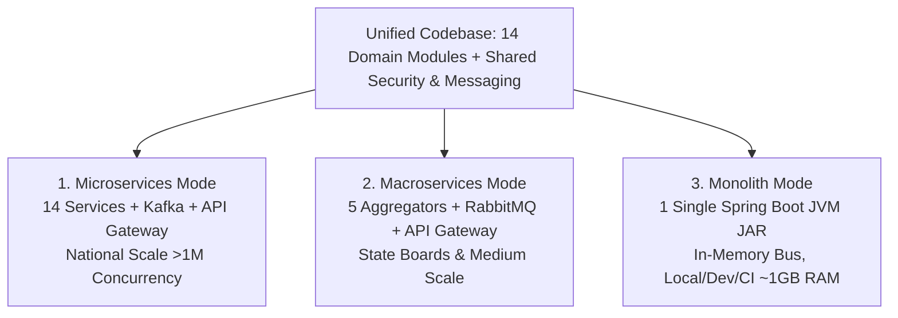
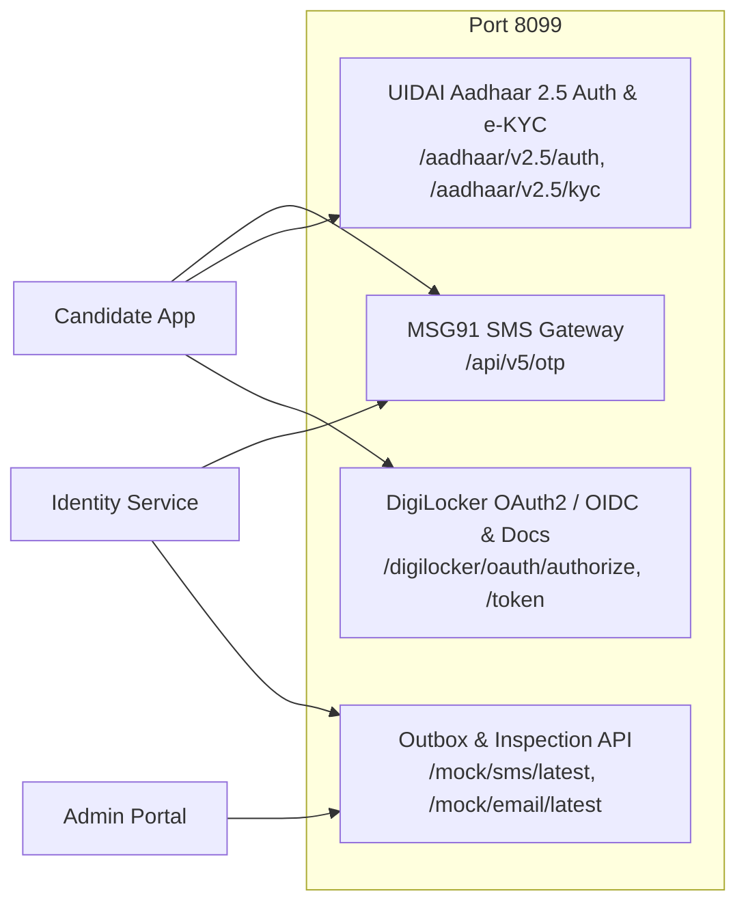

# National Assessment Grid (NAG) - Reusable Architecture & Codebase Context

> **Open Digital Public Infrastructure (DPI) Platform for High-Stakes Assessments, Examinations, Certifications & Recruitment.**

---

## 1. Executive System Overview & Tri-Mode Topology

The National Assessment Grid (NAG) is an open-source, cloud-native Digital Public Infrastructure (DPI) platform engineered from a unified codebase supporting **Tri-Mode Architecture**:



### Tri-Mode Topologies Summary

| Topology | Target Use Case | Deployable Units | Message Bus | Ingress & RAM |
|---|---|---|---|---|
| **`micro` (Scale)** | National entrance exams (>1M candidates) | 14 Microservices + Gateway | Apache Kafka (KRaft) | Spring Cloud Gateway, ~16 GB RAM |
| **`macro` (Balanced)** | State boards, universities | 5 Aggregators + Gateway | RabbitMQ / Kafka | Gateway, ~4-6 GB RAM |
| **`monolith` (Ultralight)** | Local dev, CI/CD, evaluation | 1 JVM JAR (`monolith-app`) | In-Memory Spring Events | Port `9000` (or `8080`), ~1 GB RAM |

---

## 2. Backend Architecture & Domain Modules

### 2.1 Domain Modules Matrix

| Domain Module | Micro Port | Macro Aggregator | Responsibilities & APIs |
|---|---|---|---|
| **Identity & Access** (`identity-service`) | `8081` | `auth-admin-app` | Keycloak OIDC/OAuth2, TOTP 2FA, WebAuthn/FIDO2, Admin Invitations, RBAC, Rate Limiting |
| **Candidate Service** (`candidate-service`) | `8082` | `auth-admin-app` | Candidate profile, Aadhaar/DigiLocker KYC, biometric consent, educational records |
| **Admin Service** (`admin-service`) | `8093` | `auth-admin-app` | Tenant management, system configurations, dynamic feature flags |
| **Notification Service** (`notification-service`) | `8092` | `auth-admin-app` | Email, SMS (MSG91), Webhooks, SSE notifications |
| **Question Bank** (`question-bank-service`) | `8083` | `content-app` | Multilingual question authoring, LaTeX math, taxonomies, item pooling |
| **Examination Service** (`examination-service`) | `8085` | `content-app` | Exam cycles, scheduling, shifts, center/seat allocations |
| **Paper Generator** (`paper-generator`) | `8086` | `content-app` | Blueprint randomization, AES-256 envelope encryption, Merkle tree generation, ledger anchoring |
| **Asset Service** (`asset-service`) | `8095` | `content-app` | S3 / MinIO / Local media uploads & secure presigned URLs |
| **Delivery Service** (`delivery-service`) | `8087` | `execution-app` | High-throughput CBT candidate test engine, time-lock verification |
| **Response Service** (`response-service`) | `8088` | `execution-app` | Answer ingestion, auto-save heartbeat, payload batching |
| **Evaluation Service** (`evaluation-service`) | `8089` | `post-exam-app` | Objective auto-grading, anonymized double-blind subjective grading |
| **Result Service** (`result-service`) | `8090` | `post-exam-app` | Score normalization, percentiles, merit rank lists, DigiLocker scorecards |
| **Analytics Service** (`analytics-service`) | `8094` | `post-exam-app` | Item discrimination ($$R_{bis}$$), psychometric analysis, live exam proctoring KPIs |
| **Audit Service** (`audit-service`) | `8091` | Standalone | Immutable, append-only hash-chained ledger trail (`SHA-256`), decentralized ledger anchoring bridge |
| **API Gateway** (`api-gateway`) | `9000` | Gateway | Central JWT authentication filter, dynamic tenant routing, rate limiter |

### 2.2 Core Shared Libraries (`backend/shared-lib`)
- **`com.examplatform.shared.response.ApiResponse<T>`**: Standardized JSON API wrapper (`data`, `status`, `message`, `errors`, `timestamp`).
- **`com.examplatform.shared.security`**: JWT decoder, Keycloak realm converter, tenant resolver (`X-Tenant-Id`).
- **`com.examplatform.shared.audit`**: Asynchronous `AuditEventPublisher` producing immutable audit records.

---

## 3. Frontend Architecture (`nag-frontend-workspace`)

The frontend is an **Nx Monorepo** powered by **Angular 19/20 Standalone Architecture** with Tailwind CSS and Angular Material:

```
nag-frontend-workspace/
├── apps/
│   ├── admin-portal/          # Admin, Author, Evaluator, Controller Gateway (Port 4201)
│   ├── candidate-delivery/    # Candidate CBT Delivery, KYC, Practice & Results (Port 4200)
│   └── public-verifier/       # Public QR & Cryptographic Credential / Paper Verifier (Port 4202)
├── libs/
│   ├── shared/
│   │   ├── data-access-auth/  # AuthService, UserRoleService, Auth Guards, Interceptors
│   │   ├── ui-components/     # SearchInput, Pagination, Dialogs, Brand Headers
│   │   ├── util-crypto/       # WebCrypto SHA-256, Merkle verification, HMAC, signature verifiers
│   │   └── util-i18n/         # Multi-language translation pipes & Indic font support
│   ├── questions/             # Question Authoring & Bank UI modules
│   ├── examinations/          # Exam Scheduling & Paper Generation UI modules
│   └── evaluation/            # Grading & Evaluation UI modules
```

### 3.1 Angular & UX Component Engineering Guidelines
1. **Strict File Triad Separation**: Every component has discrete `.ts`, `.html`, and `.scss` files. Inline styles or templates are prohibited.
2. **Component Decomposition (SRP)**: Any component exceeding 250 HTML lines or 200 TS lines is decomposed into sub-components under `components/<sub-name>/`.
3. **Signal Reactivity**: `signal()`, `computed()`, `input()`, `output()`, and `inject()` are standard. Avoid legacy `@Input()` / `@Output()` decorators and avoid untracked mutations.
4. **Defensive Programming**: Safe fallback on null/undefined strings before calling string methods (`(val || '').toLowerCase().trim()`).
5. **Layout Protection**: Mandatory preservation of `<router-outlet>` in main shell containers.

---

## 4. Third-Party DPI Mock Server (`infrastructure/mock-server`)

A zero-dependency, high-performance simulator for Indian Digital Public Infrastructure (DPI) services:



### Deterministic Test Personas & Endpoints

| Persona / Service | Test Value | Behavior / Expected Response |
|---|---|---|
| **Default Test OTP** | `000000` or `123456` | Universally accepted by MSG91 mock & backend for local tests |
| **General Candidate** | Aadhaar `123456789012` | Returns Aditya Sharma, full demographic record & address |
| **Female Candidate** | Aadhaar `111122223333` | Returns Priya Patel, valid demographic KYC |
| **OBC / EWS Candidate**| Aadhaar `777788889999` | Returns Rahul Verma, caste & income certificates linked |
| **Locked Biometrics** | Aadhaar `333333333333` | Returns `423 Locked` (`K-200`) simulating UIDAI biometric lock |
| **Invalid Resident** | Aadhaar `999999999999` | Returns `404 Not Found` (`K-100`) |
| **SMS Outbox Inspection**| `GET /mock/sms/latest?mobile=<num>` | Returns latest SMS payload and extracted OTP for E2E tests |
| **Email Outbox Inspection**| `GET /mock/email/latest?email=<addr>` | Returns latest dispatched email and verification code |
| **Chaos Injection** | `POST /mock/chaos` | Injects network latency or HTTP 500/503 upstream outages |

---

## 5. Automated Verification & Testing Commands

### 5.1 Mock Server Tests
```bash
cd infrastructure/mock-server
npm test
```

### 5.2 Frontend Workspace Tests (Jest)
```bash
cd nag-frontend-workspace

# Candidate Delivery (37 suites / 109 tests)
npx nx test candidate-delivery

# Admin Portal (23 suites / 89 tests)
npx nx test admin-portal

# Public Verifier
npx nx test public-verifier

# Run all tests across workspace
npx nx run-many -t test
```

### 5.3 Frontend E2E Tests (Playwright)
```bash
cd nag-frontend-workspace

# Run Playwright E2E suites
npx nx run-many -t e2e
```

### 5.4 Backend Gradle Tests
```bash
# Identity Service unit & integration tests
./gradlew :backend:identity-service:test

# Full backend build
./gradlew build -x test
```

### 5.5 Docker Deployments
```bash
# Monolith (Ultralight single-JVM mode)
./infrastructure/docker-compose/redeploy-monolith.sh

# Macro-Services mode
./infrastructure/docker-compose/redeploy-macro.sh

# Full Microservices mode
./infrastructure/docker-compose/redeploy-micro.sh
```

---

## 6. Security, Authentication & 2FA Flow Summary

### Candidate Registration & Verification
1. Registration form sends `POST /api/v1/identity/register`.
2. Backend generates Email OTP and optional SMS OTP via MSG91.
3. Candidate verifies 6-digit code on `/verify-otp` (Email tab or Mobile SMS tab with weekly quota and 30s cooldown).
4. Account transitions to `ACTIVE` and JWT access/refresh tokens are stored in `localStorage`.

### Admin Invitation & MFA / TOTP 2FA Onboarding
1. Superadmin issues invitation via `POST /api/v1/identity/admin/invite`.
2. Invitee receives tokenized link: `/auth/accept-invite?token=<token>`.
3. Invitee validates token (`/validate`), sets password (min 8 chars), and pairs 2FA app using dynamic QR code (`otpauth://`) or secret key.
4. Invitee enters 6-digit TOTP code (`/accept`) to activate account and receive JWT tokens.
5. On subsequent logins, if MFA is required, the login prompt step-up requests the 6-digit Authenticator code before issuing access tokens.
