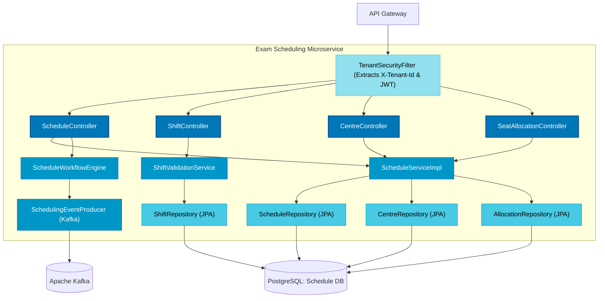

# C4 Model Level 3: Component Diagram — Exam Scheduling & Delivery Services

## 1. Overview

The Component Diagram details the internal components of the **Exam Scheduling Service** and **Exam Delivery Service**, showing Controllers, Services, Repositories, Security Interceptors, and Event Producers.

---

## 2. Exam Scheduling Service Component Diagram (Mermaid)

---

## 3. Internal Component Responsibilities

### 3.1 Security & Filtering
- **TenantSecurityFilter**: Validates `X-Tenant-Id` and `Authorization` headers, populating `SecurityContextHolder` with tenant context and user roles before controller execution.

### 3.2 Controllers
- **ScheduleController**: REST endpoints for creating draft schedules (`POST /{examId}/schedules`), listing versions, and triggering workflow transitions (`PUT /{examId}/schedules/{scheduleId}/transition`).
- **ShiftController**: Endpoints for adding/updating shifts (`POST/PUT /{examId}/schedules/{scheduleId}/shifts`).
- **CentreController**: Managing test center registries (`POST /centres`, `GET /centres?state=&city=`).
- **SeatAllocationController**: Upserting seat capacity per shift and center.

### 3.3 Business Logic Services
- **ScheduleWorkflowEngine**: Enforces approval state machine rules (`DRAFT` $\rightarrow$ `SCHEDULER_REVIEW` $\rightarrow$ `CONTROLLER_APPROVED` $\rightarrow$ `SECURITY_REVIEW` $\rightarrow$ `CHAIRMAN_APPROVED` $\rightarrow$ `PUBLISHED` / `CANCELLED`).
- **ShiftValidationService**: Enforces timing invariants ($reportingTime < gateClosingTime < loginStartTime < examStartTime < examEndTime$).

### 3.4 Data Access & Messaging
- **Repositories**: Spring Data JPA repositories interfacing with PostgreSQL.
- **SchedulingEventProducer**: Publishes `ScheduleStateChangedEvent` to Kafka for downstream consumption.
