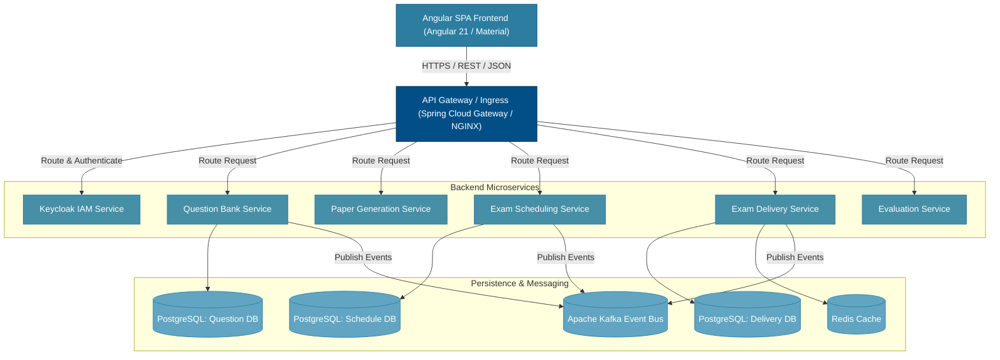

# C4 Model Level 2: Container Diagram — National Assessment Grid

## 1. Overview

The Container Diagram illustrates the high-level technical building blocks of the NAG platform: the Angular Single Page Application (SPA), API Gateway, Spring Boot backend microservices, datastores, and message brokers.

---

## 2. Container Diagram (Mermaid)

---

## 3. Container Descriptions

| Container | Technology | Responsibilities |
|---|---|---|
| **Angular SPA Frontend** | Angular 21, SCSS, Material | Client UI for candidate portal, authoring tool, scheduling dashboard, and evaluation console. |
| **API Gateway** | Spring Cloud Gateway | Ingress routing, TLS termination, global rate limiting, tenant header validation (`X-Tenant-Id`). |
| **Question Bank Service** | Java 21, Spring Boot | Manages question authoring, section definitions, taxonomy metadata, and review workflows. |
| **Paper Generation Service**| Java 21, Spring Boot, Cryptography | Automated question selection engine, multi-set paper packaging, paper AES-256 encryption. |
| **Exam Scheduling Service** | Java 21, Spring Boot | Manages schedule versions, approval state transitions, shift timing rules, and center seat allocations. |
| **Exam Delivery Service** | Java 21, Spring Boot | High-throughput candidate test session management, response bundle ingestion, time-lock enforcement. |
| **Evaluation Service** | Java 21, Spring Boot | Automated grading for objective items, anonymized token assignment for subjective evaluation. |
| **Apache Kafka** | Apache Kafka 3.x | Asynchronous event bus for domain events and audit log streaming. |
| **PostgreSQL Datastores** | PostgreSQL 16 | Dedicated relational datastore per microservice with Row-Level Security (RLS). |
