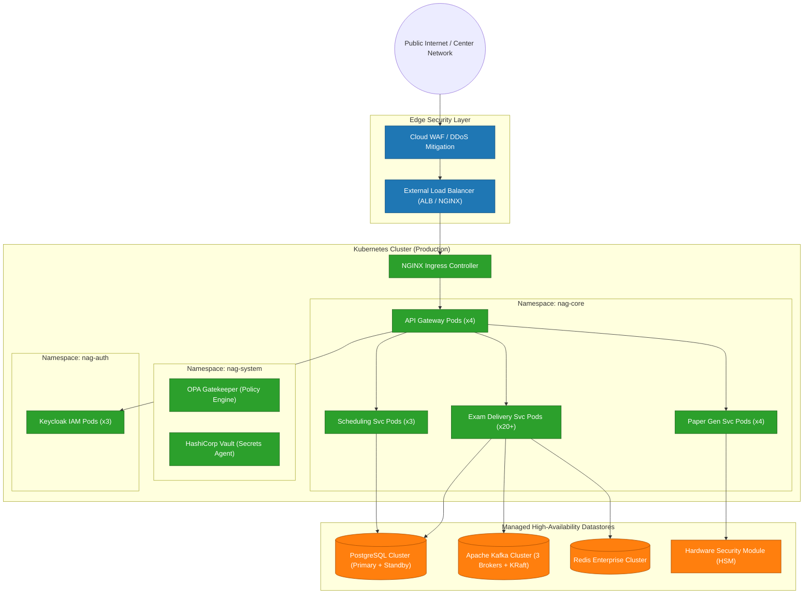

# Deployment Architecture — National Assessment Grid

## 1. Overview

The production deployment architecture for the National Assessment Grid (NAG) relies on Kubernetes container orchestration across multi-availability zone (Multi-AZ) cloud or high-security government data center infrastructure (NIC / State Data Centers).

---

## 2. Infrastructure Deployment Diagram (Mermaid)

---

## 3. High Availability & Scaling Strategy

### 3.1 Horizontal Pod Autoscaling (HPA)
- **Exam Delivery Service**: Scales dynamically between 5 and 50 pods based on CPU utilization ($>70\%$) and active HTTP request rate per second.
- **API Gateway**: Scales between 3 and 10 pods during scheduled exam start windows.

### 3.2 Database High Availability
- **Primary-Standby Replication**: PostgreSQL configured with Streaming Replication across Multi-AZ zones with automatic failover via Patroni.
- **PgBouncer**: Deployed as sidecars / DaemonSet to handle connection pooling for microservices.

### 3.3 Zero-Downtime Rolling Upgrades
- Kubernetes deployment strategies use `maxSurge: 25%` and `maxUnavailable: 0` during rolling updates to guarantee zero service interruption for active candidates.
