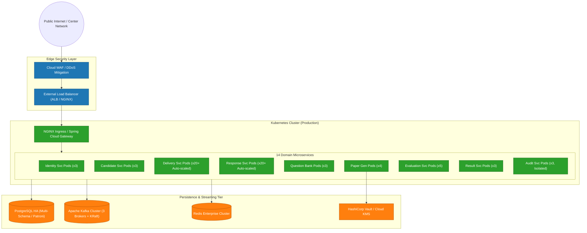
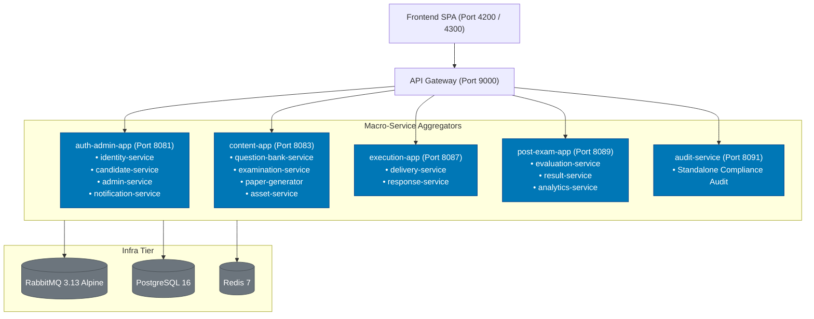
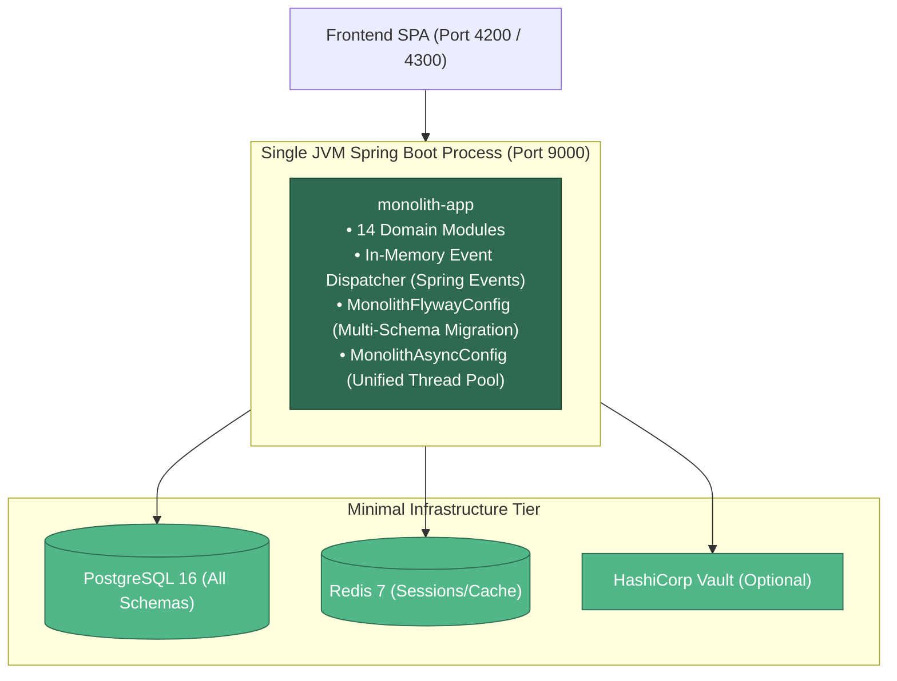

# Deployment Architecture — National Assessment Grid

## 1. Overview

The National Assessment Grid (NAG) is designed for versatile operational deployment across multiple environments. The platform provides pre-packaged configurations for three distinct deployment topologies:

1. **Microservices Deployment** (Production Kubernetes / Cloud Multi-AZ / High Scale)
2. **Macro-Services Deployment** (Consolidated Containers / EC2 Single or Dual VM / Medium Scale)
3. **Single JVM Monolith Deployment** (Standalone Single JVM / Ultralight / Development & Testing)

---

## 2. Deployment Topologies

### Topology 1: Full Microservices Deployment (Kubernetes)

Ideal for national testing agencies, multi-tenant state boards, and peak examination sessions handling 100,000 to 1,000,000+ concurrent candidates.



---

### Topology 2: Macro-Services Deployment (EC2 / VM / Docker Compose)

Consolidates the 14 domain modules into 5 high-cohesion deployable units + API Gateway + RabbitMQ. Requires ~2.5 GB RAM and runs comfortably on a single AWS EC2 `t3.medium` or `t3.large`.



---

### Topology 3: Single JVM Monolith Deployment (Ultralight / Dev / PoC)

Embeds all 14 domain services into a single Spring Boot application (`monolith-app`) using Spring in-memory event dispatching without external message brokers.



---

## 3. Deployment Scripts & Orchestration

The project includes purpose-built shell scripts located in `infrastructure/docker-compose/`:

| Script | Mode | Use Case |
|---|---|---|
| [`redeploy-monolith.sh`](file:///C:/Users/sheel/IdeaProjects/nag/infrastructure/docker-compose/redeploy-monolith.sh) | **Monolith** | Clean build, migration, and startup of the single JVM stack. |
| [`redeploy-macro.sh`](file:///C:/Users/sheel/IdeaProjects/nag/infrastructure/docker-compose/redeploy-macro.sh) | **Macro** | Clean build and launch of the 5 macro units + RabbitMQ. |
| [`redeploy-micro.sh`](file:///C:/Users/sheel/IdeaProjects/nag/infrastructure/docker-compose/redeploy-micro.sh) | **Micro** | Clean build and deployment of the 14 microservices + Kafka. |
| [`build-and-deploy.sh`](file:///C:/Users/sheel/IdeaProjects/nag/infrastructure/docker-compose/build-and-deploy.sh) | **Flexible** | Build with optional flags (`--observability`, `--ai`, `--service <name>`). |

### Common Flags for Redeploy Scripts
- `--observability` : Enables Prometheus, Grafana, and Jaeger tracing.
- `--ai` : Enables local Ollama, LiteLLM, and IndicTrans2 neural translation pipeline.
- `--no-cache` : Rebuilds Docker images without Docker cache.
- `--restart` : Restarts existing containers without rebuilding.
- `--health` : Checks container and actuator health endpoints.

---

## 4. Kubernetes & Helm Support

Helm charts in `infrastructure/helm/examination-platform/` support both microservices and macro-services through values overlays:

- **Microservices Deployment**:
  ```bash
  helm upgrade --install exam-platform ./infrastructure/helm/examination-platform \
    -f ./infrastructure/helm/examination-platform/values.yaml \
    -f ./infrastructure/helm/examination-platform/values-production.yaml
  ```

- **Macro-Services Deployment**:
  ```bash
  helm upgrade --install exam-platform ./infrastructure/helm/examination-platform \
    -f ./infrastructure/helm/examination-platform/values.yaml \
    -f ./infrastructure/helm/examination-platform/values-macro.yaml
  ```
