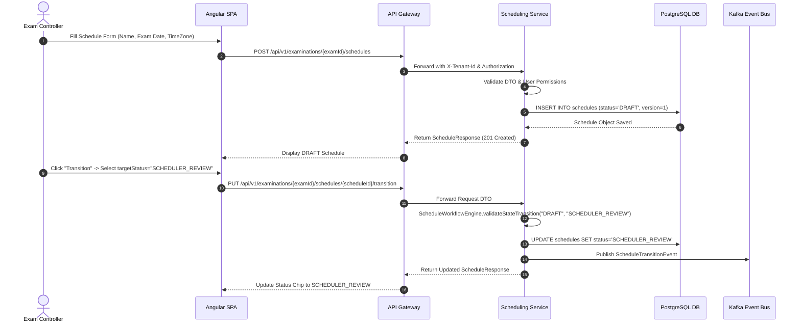
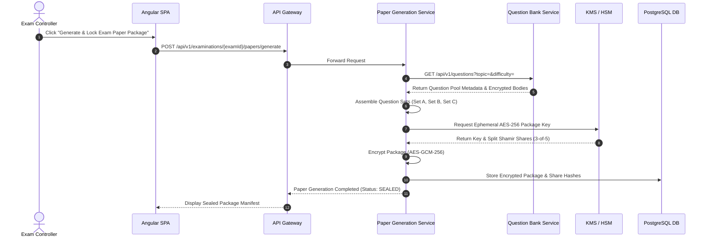
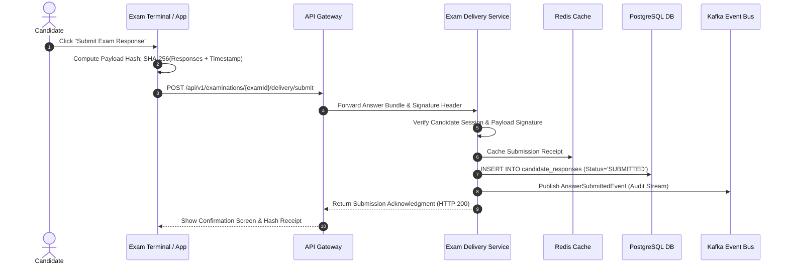

# Sequence Diagrams — National Assessment Grid

## 1. Overview

This document illustrates the core end-to-end sequence flows across NAG microservices for key workflows:
1. Schedule Creation & Approval Workflow Transition
2. Cryptographic Paper Generation & Package Locking
3. Candidate Answer Submission & Signature Verification

---

## 2. Schedule Creation & Workflow Transition Sequence

---

## 3. Cryptographic Paper Generation & Distribution

---

## 4. Candidate Answer Submission & Audit Signing

