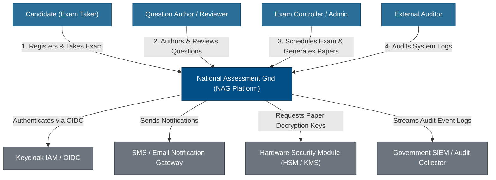

# C4 Model Level 1: System Context — National Assessment Grid

## 1. Overview

The System Context Diagram shows the National Assessment Grid (NAG) platform in relation to external users (candidates, authors, controllers, administrators) and external third-party systems.

---

## 2. System Context Diagram (Mermaid)

---

## 3. User Personas & Interacting Systems

### 3.1 Platform Users
- **Candidate**: Accesses the platform to register, view schedules, take timed online exams, and view score results.
- **Question Author & Reviewer**: Authors questions, assigns difficulty levels, tags subjects, and performs multi-stage quality reviews.
- **Exam Controller**: Configures exam rules, manages schedule versions, conducts workflow approvals, allocates exam centers, and triggers cryptographic paper generation.
- **Auditor**: Inspects immutable audit logs and verify system compliance.

### 3.2 External Systems
- **Keycloak IAM**: Provides OIDC user authentication, SSO, multi-factor authentication (MFA), and tenant realm routing.
- **SMS / Email Gateway**: Delivers candidate notifications, registration OTPs, and schedule announcements.
- **HSM / KMS**: Stores master encryption keys and handles split-key Shamir reconstructions.
- **SIEM Collector**: Consumes realtime audit logs for national cybersecurity monitoring.
