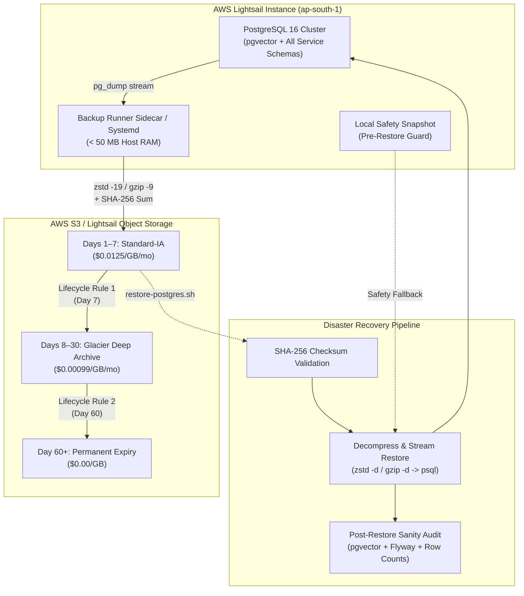

# PostgreSQL Automated Backup & Disaster Recovery (DR) Pipeline

## 📌 Overview

This document specifies the operational design, configuration, and execution procedures for the **National Assessment Grid (NAG)** PostgreSQL automated backup and disaster recovery (DR) restoration pipeline.

The architecture provides resilient, encrypted, and ultra-economical backups with support for all platform microservice schemas, `pgvector` similarity search embeddings, and automatic AWS S3 lifecycle tiering for **less than $1.00/month**.

---

## 🏗 Architecture & Data Flow



---

## 💰 Cost Optimization Strategy & Economics

### Target: < $1.00 / month

| Storage Layer / Operation | Rate | Typical Monthly Usage | Estimated Cost |
| :--- | :--- | :--- | :--- |
| **AWS Lightsail Object Storage** (Option 1) | Flat $1.00 / mo (includes 5 GB) | 1–5 GB total | **$1.00** |
| **AWS S3 Standard-IA** (Days 1–7) | $0.0125 / GB / mo | ~1 GB (7 daily dumps @ ~150 MB compressed) | **$0.013** |
| **AWS S3 Glacier Deep Archive** (Days 8–30) | $0.00099 / GB / mo | ~3.5 GB (23 daily dumps) | **$0.003** |
| **In-Region Data Transfer** | Free (Same AWS region as Lightsail instance) | Unlimited | **$0.00** |
| **PUT / LIST API Requests** | $0.005 / 1,000 requests | ~60 requests / month | **<$0.001** |
| **Total Estimated S3 Cost** | — | **~30 days retention** | **~$0.02 – $0.05 / month** |

### Key Economic Levers
1. **High-Ratio Stream Compression (`zstd -19` or `gzip -9`)**:
   - Reduces raw relational + vector SQL dumps by 70% to 85%.
   - Streams directly without creating massive uncompressed temporary files on disk.
2. **Same-Region Free Egress**:
   - Running the backup job in the same AWS region (e.g. `ap-south-1` Mumbai) as the S3 bucket ensures $0.00 data transfer egress fees.
3. **Immediate Local Cleanup**:
   - Backups are pruned from the Lightsail host disk immediately after successful S3 upload, preventing disk exhaustion on low-cost virtual instances.
4. **Lifecycle Rule 3 (`AbortIncompleteMultipartUpload`)**:
   - Any broken multipart upload is automatically aborted after 1 day to eliminate hidden storage charges.

---

## 📦 Multi-Schema & pgvector Coverage

The backup pipeline dumps the complete PostgreSQL cluster database or designated schemas, fully preserving:

- **All Platform Microservice Schemas**:
  - `identity_service`: Auth credentials, roles, MFA, refresh tokens
  - `candidate_service`: Candidate profiles, education, KYC, KYC documents metadata
  - `question_service`: Questions, options, taxonomies, embeddings
  - `examination_service`: Exams, schedules, blueprints, test centers
  - `paper_generator`: Generated exam papers, section blueprints
  - `delivery_service`: Real-time exam sessions, candidate test states
  - `response_service`: Candidate question responses, timestamps
  - `evaluation_service`: Automated grading, rubric evaluations
  - `result_service`: Scores, percentiles, ranking reports
  - `audit_service`: Immutable security audit event logs
  - `notification_service`: Email/SMS notification templates and dispatches
  - `admin_service`: System settings, tenant configs, feature toggles
  - `analytics_service`: Performance metrics, platform telemetries
  - `asset_service`: File metadata, digital asset indices
  - `practice_service`: Practice test suites, bilingual mocks
  - `recommendation_service`: AI learning recommendations
  - `keycloak`: Identity provider user store
  - `public`: Core database functions and shared utilities
- **Database Extensions**:
  - `vector`: `pgvector` halfvec and standard vector types, HNSW and IVFFlat index definitions
  - `uuid-ossp`: UUID v4 and UUID generation functions
- **Schema Migrations**:
  - `flyway_schema_history` across all individual service schemas

---

## 🛠 Backup Utility: `scripts/backup-postgres.sh`

### Features
- Non-blocking online backup using `pg_dump` with consistent snapshot isolation.
- Automatic compression selection (`zstd -19` with fallback to `gzip -9`).
- Cryptographic SHA-256 checksum manifest creation (`<file>.sha256`).
- Direct S3 upload with `--storage-class STANDARD_IA`.
- Optional webhook notifications (Slack / Discord / SNS) for failures and completions.

### Command-Line Arguments & Environment Variables

```bash
# General Usage
./scripts/backup-postgres.sh [OPTIONS]

# Options
  -b, --bucket <bucket>          S3 bucket name (env: S3_BUCKET)
  -p, --prefix <prefix>          S3 prefix (default: backups/postgres, env: S3_PREFIX)
  -s, --storage-class <class>    S3 Storage Class (default: STANDARD_IA, env: S3_STORAGE_CLASS)
  -c, --compression <algo>       Compression: auto, zstd, gzip (default: auto)
  -o, --output-dir <path>        Local directory for temporary dump (default: /tmp/nag-postgres-backups)
      --schemas <list>           Comma-separated list of schemas (default: all schemas)
      --keep-local               Retain local archive after upload (default: false)
      --no-upload                Skip S3 upload; generate local archive only
      --endpoint-url <url>       Custom S3 endpoint URL (Lightsail / MinIO)
      --webhook-url <url>        Webhook URL for alert dispatch
  -h, --help                     Display help manual
```

### Examples

#### 1. Manual Backup & Upload to S3
```bash
export S3_BUCKET="nag-production-backups"
export POSTGRES_HOST="localhost"
export POSTGRES_PORT="5432"
export POSTGRES_USER="exam_admin"
export POSTGRES_PASSWORD="your_secure_password"
export POSTGRES_DB="exam_platform"

./scripts/backup-postgres.sh
```

#### 2. Local-Only Backup (e.g. before major deployment)
```bash
./scripts/backup-postgres.sh --no-upload --output-dir /var/backups/nag
```

#### 3. Backup to AWS Lightsail Object Storage
```bash
./scripts/backup-postgres.sh \
  --bucket nag-lightsail-bucket \
  --endpoint-url https://s3.ap-south-1.amazonaws.com
```

---

## 🔄 Restoration Utility: `scripts/restore-postgres.sh`

### Features
1. **Pre-Restoration Safeguards**:
   - **Interactive Confirmation**: Operators must explicitly confirm database overwrite (bypassed with `--non-interactive`).
   - **Automated Safety Snapshot**: Captures a snapshot of the active target database before any DROP/CREATE queries execute.
   - **SHA-256 Checksum Validation**: Downloads the `.sha256` manifest from S3 or disk and verifies byte integrity before restoring.
2. **Stream Restoration**:
   - Decompresses `.zst` or `.gz` on-the-fly and pipes into `psql`.
3. **Post-Restoration Sanity Checks**:
   - Verifies database connectivity.
   - Audits `pgvector` extension and executes a sample cosine/L2 distance query (`SELECT '[1,2,3]'::vector <-> '[3,2,1]'::vector`).
   - Inspects Flyway migration history tables across schemas.
   - Audits row counts across core platform fact tables (`users`, `questions`, `examinations`, `results`, `system_settings`, etc.).

### Command-Line Arguments

```bash
# General Usage
./scripts/restore-postgres.sh [OPTIONS] [--latest | <s3-uri-or-filename>]

# Options
  --latest                       Find and restore the newest backup in S3
  <s3-uri-or-filename>           S3 URI or local file path
  --target-db <name>             Target database (default: exam_platform)
  -y, --yes, --non-interactive   Skip interactive confirmation prompt
  --skip-snapshot                Skip pre-restoration safety snapshot
  --skip-checksum                Skip SHA-256 verification (NOT recommended)
  --keep-downloaded              Keep downloaded S3 archives in temp directory
  -b, --bucket <bucket>          S3 bucket name (env: S3_BUCKET)
  -p, --prefix <prefix>          S3 key prefix (default: backups/postgres)
  --endpoint-url <url>           Custom S3 endpoint URL
  -h, --help                     Display help manual
```

### Examples

#### 1. Restore the Most Recent Backup from S3
```bash
S3_BUCKET="nag-production-backups" ./scripts/restore-postgres.sh --latest
```

#### 2. Restore to an Isolated Staging Database for Testing
```bash
./scripts/restore-postgres.sh \
  s3://nag-production-backups/backups/postgres/nag-db-exam_platform-20261009_020000Z.sql.zst \
  --target-db exam_platform_staging
```

#### 3. Non-Interactive Restoration (Automated DR Drill)
```bash
./scripts/restore-postgres.sh \
  --latest \
  --bucket nag-production-backups \
  --non-interactive
```

---

## ⏱ Automated Scheduling Options

### Option A: Lightweight Docker Sidecar Runner (< 50MB RAM)
The backup runner can be deployed alongside the database as a Docker Compose service:

```bash
# Start the backup sidecar runner in the background
docker compose -f infrastructure/docker-compose/docker-compose.yml \
               -f infrastructure/docker-compose/docker-compose.backup.yml up -d postgres-backup
```

The sidecar container runs Alpine Linux with `crond` configured to execute daily at `02:00 UTC`.

### Option B: Host Systemd Timer (Recommended for Virtual Machines)
1. Copy the systemd service and timer files:
   ```bash
   sudo cp infrastructure/systemd/nag-postgres-backup.service /etc/systemd/system/
   sudo cp infrastructure/systemd/nag-postgres-backup.timer /etc/systemd/system/
   ```
2. Create environment configuration `/etc/nag/backup.env`:
   ```bash
   sudo mkdir -p /etc/nag
   sudo tee /etc/nag/backup.env << 'EOF'
   POSTGRES_HOST=localhost
   POSTGRES_PORT=5432
   POSTGRES_DB=exam_platform
   POSTGRES_USER=exam_admin
   POSTGRES_PASSWORD=your_secure_password
   S3_BUCKET=nag-production-backups
   S3_STORAGE_CLASS=STANDARD_IA
   AWS_DEFAULT_REGION=ap-south-1
   EOF
   sudo chmod 600 /etc/nag/backup.env
   ```
3. Enable and start the timer:
   ```bash
   sudo systemctl daemon-reload
   sudo systemctl enable --now nag-postgres-backup.timer
   sudo systemctl status nag-postgres-backup.timer
   ```

---

## 🔒 AWS S3 & IAM Provisioning

### 1. S3 Lifecycle Rules Configuration
Apply the lifecycle policy located at `infrastructure/aws/s3-lifecycle-policy.json`:

```bash
aws s3api put-bucket-lifecycle-configuration \
  --bucket YOUR_BACKUP_BUCKET_NAME \
  --lifecycle-configuration file://infrastructure/aws/s3-lifecycle-policy.json
```

**Configured Rules**:
- **Rule 1**: Transition objects under `backups/postgres/` to `DEEP_ARCHIVE` after **7 days**.
- **Rule 2**: Expire and permanently delete backups after **60 days**.
- **Rule 3**: Abort incomplete multipart uploads after **1 day**.

### 2. Least-Privilege IAM Policy
Create the IAM policy using `infrastructure/aws/iam-backup-policy.json`:

```bash
# Replace YOUR_BACKUP_BUCKET_NAME in the file, then create policy
aws iam create-policy \
  --policy-name NagPostgresBackupPolicy \
  --policy-document file://infrastructure/aws/iam-backup-policy.json
```

Attach this policy to the IAM role or user used by the Lightsail instance or backup container.

---

## 🚨 Disaster Recovery (DR) Runbook & Drills

### Recovery Objectives
- **Recovery Point Objective (RPO)**: ≤ 24 hours (daily backup schedule at 02:00 UTC).
- **Recovery Time Objective (RTO)**: ≤ 15 minutes (full cluster restore and verification).

### Step-by-Step DR Walkthrough

```
[Incident Detected]
       │
       ▼
1. Validate database failure and isolate traffic
       │
       ▼
2. Check S3 bucket connectivity & list available archives
   $ aws s3 ls s3://YOUR_BACKUP_BUCKET/backups/postgres/
       │
       ▼
3. Execute restore pipeline
   $ ./scripts/restore-postgres.sh --latest --bucket YOUR_BACKUP_BUCKET
       │
       ├─► Verification: SHA-256 Checksum verified
       ├─► Safety: Pre-restore snapshot taken
       ├─► Restore: SQL stream executed into PostgreSQL 16
       └─► Audit: pgvector, Flyway, and row counts reported
       │
       ▼
4. Run application health checks
   $ curl -f http://localhost:8080/actuator/health
       │
       ▼
[Traffic Restored]
```
