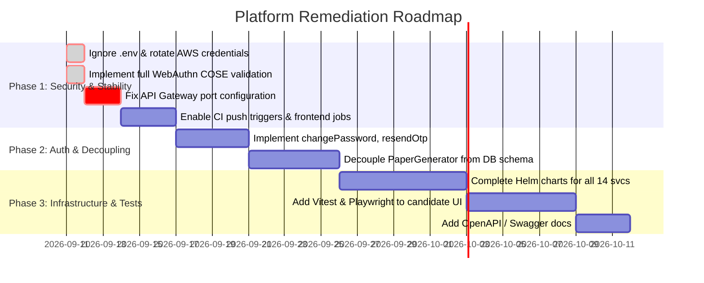

# Platform Gaps & Technical Debt Analysis

> **Document Version:** 1.0.2  
> **Last Updated:** 2026-09-11  
> **Repository:** `natassgrid/nag`  
> **Scope:** Entire platform (Backend microservices, Macroservices, Monolith, Frontend SPAs, Infrastructure, CI/CD, and Security)

---\n## Executive Summary

A comprehensive architectural and code-level audit was conducted across the National Assessment Grid (NAG) platform. The platform demonstrates strong architectural foundations:
- **Tri-Mode Architecture** supporting Microservices, Macro-services, and Single-JVM Monolith.
- **REST Controller Integration Test Suite** using Testcontainers across all 14 backend microservices.
- **Unified Multi-Schema Database Migrations** managed via Flyway.
- **Accessible UI Topologies** for administrators/controllers (Angular 21) and candidates (React 19).

However, key architectural and operational gaps exist that must be addressed prior to enterprise or nation-scale production deployment. These findings are prioritized below by severity.

---\n## Gap Matrix Summary

| Category | Total Gaps | Critical | High | Medium | Low | Resolved |
|---|:---:|:---:|:---:|:---:|:---:|:---:|
| 1. Security & Authentication | 4 | 0 (was 1) | 2 (was 3) | 0 | 0 | 2 |
| 2. Gateway & Microservice Decoupling | 3 | 0 | 1 | 2 | 0 | 0 |
| 3. Business Logic & Consumer Stubs | 6 | 0 | 0 | 5 | 1 | 0 |
| 4. Frontend & Testing Automation | 3 | 0 | 2 | 0 | 1 | 0 |
| 5. Infrastructure, CI/CD & Documentation | 4 | 0 | 1 | 2 | 1 | 0 |
| **Total** | **20** | **0** | **6** | **9** | **3** | **2** |

---\n## 1. Security & Authentication Gaps

### 1.1 `.env` File Not Ignored in `.gitignore` `[RESOLVED]`
- **Severity:** `CRITICAL`
- **Status:** **RESOLVED**
- **Component:** Repository Root ([`.gitignore`](../.gitignore))
- **File Reference:** [`.gitignore`](../.gitignore), [`infrastructure/docker-compose/.env.example`](../infrastructure/docker-compose/.env.example), [`.env.example`](../.env.example)
- **Description:**  
  Local environment configuration files (such as `infrastructure/docker-compose/.env`), which contain AWS credentials (`AWS_ACCESS_KEY_ID`, `AWS_SECRET_ACCESS_KEY`) and Bedrock execution IAM roles, risked accidental git staging and commit.
- **Remediation Completed:**
  - Enhanced root [`.gitignore`](../.gitignore) with explicit glob patterns covering all root and nested `.env` variants: `.env`, `.env.*`, `.env.local`, `*.env`, `**/.env`, `**/.env.*`, `**/*.env`, while preserving `!.env.example` and `!**/.env.example`.
  - Verified git history: confirmed AWS credentials were never committed in any prior git revision.
  - Provided sanitized template [`infrastructure/docker-compose/.env.example`](../infrastructure/docker-compose/.env.example) with placeholder values.
  - Updated root [`.env.example`](../.env.example) with complete configuration options for AWS Bedrock and IndicTrans2.
  - Sanitized local [`infrastructure/docker-compose/.env`](../infrastructure/docker-compose/.env) with placeholder values.
  - Recommended AWS credential rotation in AWS IAM console as a security best practice.

### 1.2 WebAuthn Signature Verification Stub `[RESOLVED]`
- **Severity:** `HIGH`
- **Status:** **RESOLVED**
- **Component:** `identity-service`
- **File Reference:** [`WebAuthnService.java`](../backend/identity-service/src/main/java/com/examplatform/identity/service/WebAuthnService.java), [`WebAuthnServiceTest.java`](../backend/identity-service/src/test/java/com/examplatform/identity/service/WebAuthnServiceTest.java), [`build.gradle`](../backend/identity-service/build.gradle)
- **Description:**  
  The method `verifyAssertionSignature()` validated only that input strings were non-empty and Base64URL-encoded (`return authData.length > 0 && signature.length > 0 && clientDataJSON.length > 0;`). It did not decode COSE public keys or verify cryptographic ECDSA/RSA signatures.
- **Remediation Completed:**
  - Added dependency `com.webauthn4j:webauthn4j-core:0.24.1.RELEASE` to `backend/identity-service/build.gradle`.
  - Updated `verifyAssertionSignature()` in `WebAuthnService.java` to parse stored CBOR `publicKeyCose` using WebAuthn4J's `ObjectConverter` into a `COSEKey` and extract the `java.security.PublicKey`.
  - Dynamically resolved the JCA algorithm identifier (supporting ECDSA / `SHA256withECDSA`, RSA, and EdDSA) via `coseKey.getAlgorithm().toSignatureAlgorithm().getJcaName()`.
  - Constructed the authenticated payload `authenticatorData || SHA-256(clientDataJSON)` and verified the signature cryptographically via `java.security.Signature`.
  - Updated `WebAuthnServiceTest.java` to dynamically generate cryptographic P-256 keypairs, valid assertions, and signature verification failure checks (including tampered signatures and empty payloads).
  - Verified 100% test pass rate across `identity-service`.

### 1.3 Unimplemented Identity Endpoints (Change Password, Resend OTP, Logout)
- **Severity:** `HIGH`
- **Component:** `identity-service`
- **File Reference:** [`IdentityController.java`](../backend/identity-service/src/main/java/com/examplatform/identity/controller/IdentityController.java#L180-L230)
- **Description:**  
  The endpoints `PUT /api/v1/identity/users/change-password`, `POST /api/v1/identity/otp/resend`, and `DELETE /api/v1/identity/auth/logout` return HTTP 200 OK responses with hardcoded success messages, but contain commented-out TODO calls to business services.
- **Impact:** Passwords are not changed, OTPs are not resent, and refresh tokens are not revoked upon logout.
- **Mitigation:**
  - Wire `registrationService.changePassword(...)` to update password hashes in database and Keycloak.
  - Implement Redis-backed OTP re-dispatch and rate limiting.
  - Implement refresh token blacklisting in `TokenBlacklistService` or revoke sessions in Keycloak.

### 1.4 Stubbed Keycloak User Deactivation
- **Severity:** `HIGH`
- **Component:** `admin-service`
- **File Reference:** [`KeycloakAdminClientImpl.java`](../backend/admin-service/src/main/java/com/examplatform/admin/client/KeycloakAdminClientImpl.java#L28-L41)
- **Description:**  
  `KeycloakAdminClientImpl.disableUser()` logs a stub message without invoking the Keycloak Admin REST API (`PUT /admin/realms/{realm}/users/{id}`).
- **Impact:** Disabling or banning an administrator or tenant in `admin-service` does not prevent them from authenticating via Keycloak.
- **Mitigation:**
  - Implement Keycloak Admin Client with service account client-credentials grant.

---

## 2. Gateway & Microservice Decoupling Gaps

### 2.1 API Gateway Port Configuration Offsets
- **Severity:** `HIGH`
- **Component:** `api-gateway`
- **File Reference:** [`application.yml`](../backend/api-gateway/src/main/resources/application.yml#L80-L165)
- **Description:**  
  In local development mode without Docker container DNS overrides, fallback service ports are offset by one starting from port 8085:
  - `paper-generator` defaults to `http://localhost:8085` (actual port: `8086`)
  - `delivery-service` defaults to `http://localhost:8086` (actual port: `8087`)
  - `response-service` defaults to `http://localhost:8087` (actual port: `8088`)
  - `evaluation-service` defaults to `http://localhost:8088` (actual port: `8089`)
  - `result-service` defaults to `http://localhost:8089` (actual port: `8090`)
  - `audit-service` defaults to `http://localhost:8090` (actual port: `8091`)
  - `notification-service` defaults to `http://localhost:8091` (actual port: `8092`)
- **Impact:** Running services standalone locally causes `api-gateway` to route requests to the wrong services or fail with connection refused.
- **Mitigation:**
  - Correct default fallback URLs in `api-gateway/src/main/resources/application.yml` to match the actual microservice ports defined in each service's `application.yml`.

### 2.2 Direct Cross-Schema Database Coupling in Paper Generator
- **Severity:** `MEDIUM`
- **Component:** `paper-generator`
- **File Reference:** [`QuestionBankClientImpl.java`](../backend/paper-generator/src/main/java/com/examplatform/papergenerator/client/QuestionBankClientImpl.java#L52-L95)
- **Description:**  
  `paper-generator` directly executes SQL against the `question_service.question` table via `JdbcTemplate` instead of calling `question-bank-service` over REST or gRPC.
- **Impact:** Violates database-per-service isolation; breaks if `question-bank-service` moves to an independent database instance or cluster.
- **Mitigation:**
  - Expose a batch search endpoint in `question-bank-service` (e.g. `POST /api/v1/questions/blueprint-match`).
  - Update `paper-generator` to query this endpoint via `RestClient` / `WebClient`.

### 2.3 Stubbed Inter-Service Clients in Delivery Service
- **Severity:** `MEDIUM`
- **Component:** `delivery-service`
- **File References:**  
  - [`ShiftAssignmentClientImpl.java`](../backend/delivery-service/src/main/java/com/examplatform/delivery/client/ShiftAssignmentClientImpl.java)
  - [`CandidateProfileClientImpl.java`](../backend/delivery-service/src/main/java/com/examplatform/delivery/client/CandidateProfileClientImpl.java)
  - [`QuestionCacheService.java`](../backend/delivery-service/src/main/java/com/examplatform/delivery/service/QuestionCacheService.java#L100-L105)
- **Description:**  
  `delivery-service` uses in-memory stub implementations for shift assignment lookup and candidate disability accommodations instead of calling `examination-service` and `candidate-service`.
- **Impact:** Hardcoded exam durations and lack of real candidate accommodation enforcement.
- **Mitigation:**
  - Implement Spring 6 `RestClient` with resilience mechanisms (CircuitBreaker / Retry via Resilience4j).

---

## 3. Business Logic & Consumer Stubs

### 3.1 Simulated AI Proctoring Violation Detection
- **Severity:** `MEDIUM`
- **Component:** `delivery-service`
- **File Reference:** [`ProctoringAnalysisConsumer.java`](../backend/delivery-service/src/main/java/com/examplatform/delivery/consumer/ProctoringAnalysisConsumer.java#L115-L135)
- **Description:**  
  Proctoring analysis uses `random.nextDouble() < 0.10` to generate violation events (`MULTIPLE_FACES`, `NO_FACE`, `CELL_PHONE_DETECTED`, `GAZE_AWAY`).
- **Impact:** Generates synthetic proctoring flags instead of true automated surveillance.
- **Mitigation:**
  - Connect consumer to an actual inference service (e.g., Python FastAPI CV service, Triton, or AWS Rekognition) using Kafka event streams.

### 3.2 Disabled Vector Distance Operator in Similarity Lookup
- **Severity:** `MEDIUM`
- **Component:** `question-bank-service`
- **File Reference:** [`QuestionRepository.java`](../backend/question-bank-service/src/main/java/com/examplatform/questionbank/repository/QuestionRepository.java#L60-L75)
- **Description:**  
  `findSimilarPublishedQuestion()` currently executes `SELECT q.id FROM question_service.question q WHERE q.state = 'PUBLISHED' AND q.embedding IS NOT NULL LIMIT 1`, bypassing pgvector cosine distance calculation.
- **Impact:** Duplicate question detection and RAG checks return the first published row instead of semantic duplicates.
- **Mitigation:**
  - Re-enable the native pgvector query:
    ```sql
    SELECT id FROM question_service.question
    WHERE state = 'PUBLISHED'
      AND 1 - (embedding <=> cast(:embedding as halfvec(384))) > :threshold
    LIMIT 1;
    ```

### 3.3 Synthetic Item Discrimination Analytics
- **Severity:** `MEDIUM`
- **Component:** `result-service`
- **File Reference:** [`AnalyticsService.java`](../backend/result-service/src/main/java/com/examplatform/result/service/AnalyticsService.java#L88-L105)
- **Description:**  
  Item discrimination is simulated using hardcoded values (`Math.abs(item.getQuestionId().hashCode() % 60) / 100.0 + 0.2`) rather than computing Point Biserial Correlation between item scores and total test scores.
- **Impact:** Psychometric analysis and item difficulty calibration are inaccurate.
- **Mitigation:**
  - Implement standard Classical Test Theory (CTT) point-biserial correlation formula over stored candidate responses.

### 3.4 In-Memory Candidate Ingestion (Async Streaming Stub)
- **Severity:** `MEDIUM`
- **Component:** `candidate-service`
- **File Reference:** [`CandidateIngestionService.java`](../backend/candidate-service/src/main/java/com/examplatform/candidate/service/CandidateIngestionService.java#L55-L75)
- **Description:**  
  Candidate CSV bulk ingestion parses records in a single synchronous thread and commits synchronously without chunked Kafka or batch database staging.
- **Impact:** Large batch uploads (e.g., 500,000 candidates for state exams) risk HTTP timeout or `OutOfMemoryError`.
- **Mitigation:**
  - Split CSV into chunks of 1,000, stream chunk events to Kafka (`candidate.ingestion.chunks`), and consume with Spring Batch or parallel consumers.

### 3.5 Stubbed OCR Pipeline in Response Service
- **Severity:** `MEDIUM`
- **Component:** `response-service`
- **File Reference:** [`OcrProcessingConsumer.java`](../backend/response-service/src/main/java/com/examplatform/response/consumer/OcrProcessingConsumer.java#L45-L65)
- **Description:**  
  `OcrProcessingConsumer` logs OCR submission events but does not route images to Tesseract or AWS Textract, returning dummy confidence scores (0.95).
- **Impact:** Handwritten OMR/answer-sheet evaluations cannot be automated.
- **Mitigation:**
  - Connect to Tesseract OCR worker container or cloud OCR service.

### 3.6 In-Memory Certificate Generation
- **Severity:** `LOW`
- **Component:** `result-service`
- **File Reference:** [`CertificateService.java`](../backend/result-service/src/main/java/com/examplatform/result/service/CertificateService.java#L70-L90)
- **Description:**  
  Certificate generation creates temporary in-memory PDF blobs without archiving to S3/MinIO or publishing DigiLocker-compliant URI metadata.
- **Impact:** Certificates must be re-rendered on every download; cannot integrate with India Stack / DigiLocker.
- **Mitigation:**
  - Store generated PDF certificates in S3/MinIO with presigned URLs and compute SHA-256 digest for DigiLocker schema.

---

## 4. Frontend & Testing Automation Gaps

### 4.1 Missing Unit/Component Test Suite in Candidate Frontend
- **Severity:** `HIGH`
- **Component:** `candidate-frontend`
- **File Reference:** [`candidate-frontend/package.json`](../candidate-frontend/package.json)
- **Description:**  
  `candidate-frontend` has zero test scripts, no Vitest/Jest configuration, and no component test files (`*.test.tsx`).
- **Impact:** Exam delivery UI regressions, timer bugs, question navigation flaws, or offline sync failures can reach production undetected.
- **Mitigation:**
  - Add `@testing-library/react`, `vitest`, and `@vitejs/plugin-react` test runners to `candidate-frontend`.
  - Implement tests for exam player, timer countdown, question palette, and offline answer caching.

### 4.2 Missing E2E Tests for Candidate Exam Journey
- **Severity:** `HIGH`
- **Component:** Platform Test Automation
- **File Reference:** Repository Root (`e2e/`, `tests/`)
- **Description:**  
  There is no Playwright or Cypress end-to-end test suite testing the critical candidate exam journey: Login -> Hardware Check -> Instructions -> Exam Taking -> Network Disconnect/Reconnect -> Final Submit.
- **Impact:** Critical path UI and API integration bugs can disrupt live examination events.
- **Mitigation:**
  - Create Playwright test suite in `tests/e2e` simulating candidate flow against the docker-compose stack.

### 4.3 Missing Accessibility (WCAG 2.1 AA) Automated Checks
- **Severity:** `LOW`
- **Component:** `frontend`, `candidate-frontend`
- **File Reference:** `candidate-frontend/src/**`
- **Description:**  
  National examination guidelines mandate strict WCAG 2.1 AA compliance for disabled candidates (screen reader compatibility, color contrast, keyboard navigation). No automated axe-core checks are present.
- **Impact:** Non-compliance with government DPI accessibility mandates.
- **Mitigation:**
  - Add `@axe-core/playwright` or `jest-axe` to the CI pipeline to assert zero critical/serious accessibility violations.

---

## 5. Infrastructure, CI/CD & Documentation Gaps

### 5.1 Incomplete Helm Charts (Only 3 of 14 Services Defined)
- **Severity:** `HIGH`
- **Component:** Kubernetes Helm Deployment
- **File Reference:** [`infrastructure/helm/charts/`](../infrastructure/helm/charts/)
- **Description:**  
  The `infrastructure/helm/charts/` directory only defines charts for `identity-service`, `examination-service`, and `delivery-service`. The remaining 11 microservices (`candidate`, `question-bank`, `paper-generator`, `response`, `evaluation`, `result`, `proctoring`, `audit`, `notification`, `admin`, `api-gateway`) have no Helm charts.
- **Impact:** Production deployment to Kubernetes is incomplete and cannot be automated via Helm or ArgoCD.
- **Mitigation:**
  - Create a reusable library Helm chart (`examplatform-common`) and lightweight individual microservice charts for all 14 services.

### 5.2 GitHub Actions CI Restricted to `workflow_dispatch`
- **Severity:** `MEDIUM`
- **Component:** CI/CD Workflow
- **File Reference:** [`.github/workflows/ci.yml`](../.github/workflows/ci.yml#L10-L15)
- **Description:**  
  `ci.yml` declares triggers for `push` and `pull_request` on `develop` and `main`, but job execution is gated with `if: github.event_name == 'workflow_dispatch'`.
- **Impact:** Automated builds, linting, and integration tests do not execute automatically on PRs or branch pushes.
- **Mitigation:**
  - Update `if` condition to `if: github.event_name == 'workflow_dispatch' || github.event_name == 'push' || github.event_name == 'pull_request'`.

### 5.3 Frontend Builds and Tests Missing from CI Pipeline
- **Severity:** `MEDIUM`
- **Component:** CI/CD Workflow
- **File Reference:** [`.github/workflows/ci.yml`](../.github/workflows/ci.yml)
- **Description:**  
  `ci.yml` contains zero build, lint, or test jobs for `frontend` (Angular) and `candidate-frontend` (React).
- **Impact:** Frontend TypeScript compilation errors, template failures, or lint breaks pass unnoticed in CI.
- **Mitigation:**
  - Add `frontend-ci` job running `npm ci`, `npm run lint`, and `npm run build` for both SPAs.

### 5.4 Absence of OpenAPI / Swagger Specifications
- **Severity:** `LOW`
- **Component:** Backend Build & Gateway
- **File Reference:** `backend/**/build.gradle`
- **Description:**  
  No microservices include `springdoc-openapi-starter-webmvc-ui`. There is no central Swagger UI or OpenAPI 3.0 JSON specification available.
- **Impact:** Hinders third-party API integration and automated client SDK generation.
- **Mitigation:**
  - Add `org.springdoc:springdoc-openapi-starter-webmvc-ui` to `backend/shared-lib/build.gradle` and configure Gateway aggregation.

---

## Action Plan & Roadmap


